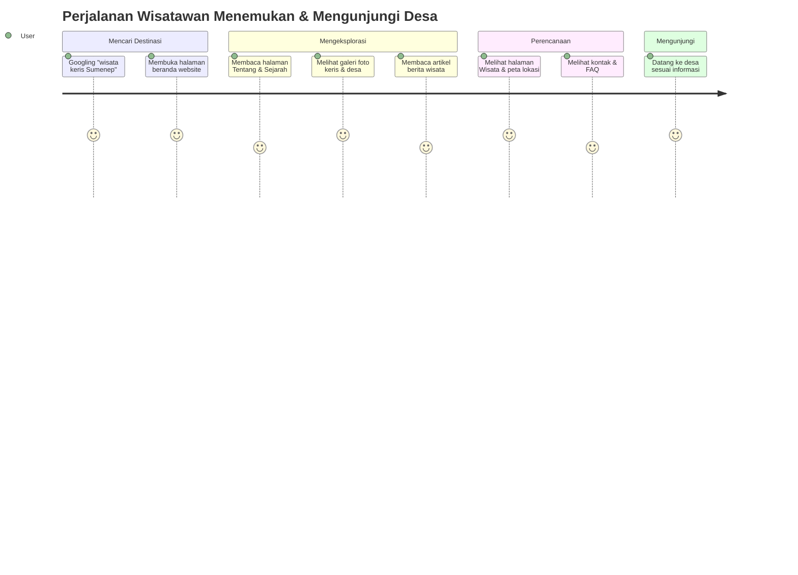
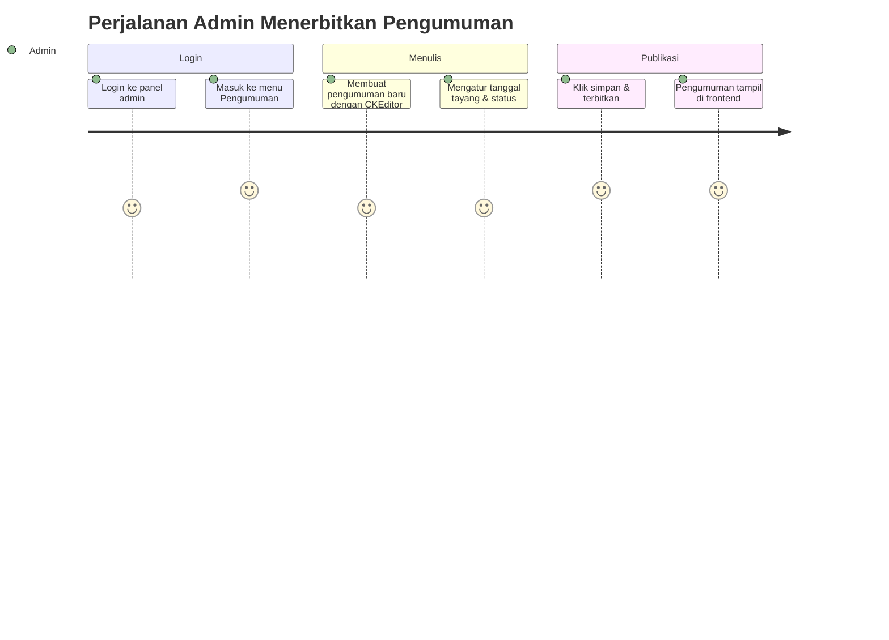

# 01 — Product Requirements Document (PRD)

**Website Profil Desa Aeng Tong-Tong**

| Properti | Nilai |
| --- | --- |
| Kode Dokumen | ATT-PRD-01 |
| Versi | 1.0 |
| Status | Final |
| Pemilik Produk | Pemerintah Desa Aeng Tong-Tong |
| Tim Penyusun | Senior PM, Business Analyst, System Analyst, Software Architect, UI/UX Designer, Database Engineer, Laravel Developer |

---

## 1. Executive Summary

Desa Aeng Tong-Tong merupakan desa wisata unggulan nasional yang dikenal sebagai Sentra Kerajinan Keris dan menjadi tempat bermukimnya para Mpu (Empu Keris). Desa ini memegang Rekor MURI sebagai desa dengan jumlah Mpu terbanyak di dunia serta menjadi **Juara 1 Anugerah Desa Wisata Indonesia (ADWI) 2022** kategori Daya Tarik Pengunjung.

Meskipun memiliki reputasi besar, Desa Aeng Tong-Tong belum memiliki media informasi digital resmi yang terpusat, terpercaya, dan mudah diakses. Seluruh informasi sejarah, budaya, pemerintahan, potensi wisata, kerajinan keris, UMKM, serta layanan publik masih tersebar di media sosial, brosur, dan lisan, sehingga sulit diakses oleh wisatawan, investor, akademisi, dan masyarakat luas.

Website Profil Desa Aeng Tong-Tong dibangun untuk menjawab masalah tersebut. Website ini menjadi **portal informasi resmi desa** yang menyajikan profil desa, sejarah, visi & misi, struktur organisasi, perangkat desa, potensi desa, wisata, kerajinan keris, UMKM, berita, pengumuman, agenda, galeri foto & video, statistik desa, APBDes, dokumen publik, dan layanan kontak/FAQ.

Produk ini dibangun menggunakan **Laravel 12**, **PHP 8.3+**, **MySQL**, **Tailwind CSS**, **Alpine.js**, serta pustaka pendukung (AOS, SweetAlert2, Chart.js, CKEditor, PDF.js) dengan prinsip *Security First*, *SEO Friendly*, *Responsive*, *Accessibility Friendly*, dan arsitektur yang mudah dipelihara.

---

## 2. Product Vision

> **"Menjadi pintu gerbang digital desa wisata pertama di Sumenep yang memperkenalkan, melestarikan, dan mengembangkan warisan budaya keris serta potensi Desa Aeng Tong-Tong kepada dunia."**

Website ini tidak hanya menjadi *company profile* desa, tetapi menjadi **pusat layanan informasi publik** yang transparan, akuntabel, dan mendukung pertumbuhan ekonomi kreatif berbasis budaya.

---

## 3. Product Goals

1. **Menyediakan informasi resmi desa** yang akurat, lengkap, dan selalu mutakhir.
2. **Mempromosikan potensi wisata dan budaya keris** kepada wisatawan domestik maupun mancanegara.
3. **Mendukung pertumbuhan UMKM dan kerajinan keris** melalui etalase digital.
4. **Meningkatkan transparansi pemerintahan desa** melalui publikasi dokumen publik, statistik, dan APBDes.
5. **Mempermudah komunikasi dua arah** antara pemerintah desa, masyarakat, dan pihak luar.
6. **Menjadi basis data referensi** bagi akademisi, peneliti, investor, dan instansi pemerintah.

---

## 4. Background

Desa Aeng Tong-Tong berada di Kecamatan Saronggi, Kabupaten Sumenep, Provinsi Jawa Timur, dan merupakan salah satu desa dengan identitas budaya paling kuat di Madura. Keunggulannya:

- **Sentra kerajinan keris nasional** — pusat pembuatan keris dengan tradisi ratusan tahun.
- **Rekor MURI** — desa dengan jumlah Mpu terbanyak di dunia.
- **ADWI 2022** — Juara 1 kategori Daya Tarik Pengunjung.
- Memiliki atraksi wisata budaya, edukasi pembuatan keris, dan potensi ekonomi kreatif.

Dengan gelar dan reputasi tersebut, desa membutuhkan media informasi yang sebanding dengan reputasinya — platform digital yang profesional, informatif, dan dapat diakses kapan saja dari mana saja.

---

## 5. Problem Statement

| No | Masalah | Dampak |
| --- | --- | --- |
| 1 | Tidak ada portal informasi resmi terpusat. | Informasi desa tersebar, tidak konsisten, dan sulit diverifikasi. |
| 2 | Promosi wisata bergantung pada pihak ketiga & medsos. | Peluang kunjungan wisatawan (domestik/mancanegara) tidak optimal. |
| 3 | Data statistik & APBDes tidak terdokumentasi publik secara transparan. | Akuntabilitas pemerintahan rendah, kepercayaan publik menurun. |
| 4 | Informasi UMKM & perajin keris tidak mudah ditemukan. | Pemasaran produk keris & UMKM terbatas, nilai ekonomi belum maksimal. |
| 5 | Komunikasi masyarakat ↔ desa tidak terstruktur. | Pertanyaan/pengaduan tidak terkelola dengan baik. |
| 6 | Tidak ada arsip dokumen publik digital. | Dokumen mudah hilang, akses publik sulit. |

---

## 6. Solution Overview

Membangun **Website Profil Desa Aeng Tong-Tong** berbasis Laravel 12 yang terdiri dari dua bagian utama:

1. **Frontend (Sisi Publik)** — portal informasi publik yang responsive, SEO-friendly, dan aksesibel, mencakup seluruh halaman profil, konten, galeri, statistik, dokumen, dan layanan kontak.
2. **Backend / Admin (CMS)** — panel administrasi berbasis peran (role & permission) untuk mengelola seluruh konten, master data, pengguna, pengaturan website, dan aktivitas log.

Arsitektur menerapkan **Service Layer**, **Repository Pattern**, **Form Request Validation**, **Policy Authorization**, **Route Model Binding**, **Blade Components**, dan **Eloquent Relationship** agar mudah dipelihara dan dikembangkan.

---

## 7. Business Objectives

| No | Objektif | Indikator | Target (12 bulan) |
| --- | --- | --- | --- |
| 1 | Meningkatkan kunjungan wisatawan | Jumlah pengunjung wisata | Naik ≥ 15% |
| 2 | Meningkatkan eksposur global keris & UMKM | Trafik dari luar negeri | ≥ 10% trafik total |
| 3 | Meningkatkan transparansi desa | Dokumen & statistik terpublikasi | 100% dokumen wajib tayang |
| 4 | Meningkatkan keterlibatan publik | Jumlah pesan/pertanyaan masuk | Terkelola dalam 1×24 jam |
| 5 | Membangun reputasi digital desa | Peringkat SEO kata kunci utama | Halaman 1 Google untuk kata kunci target |

---

## 8. Stakeholders

| Stakeholder | Peran | Kepentingan |
| --- | --- | --- |
| Pemerintah Desa Aeng Tong-Tong | Pemilik & penyedia data | Akuntabilitas, publikasi, layanan publik |
| Kepala Desa & Perangkat Desa | Penyedia konten & pengelola CMS | Kemudahan pengelolaan konten |
| Dinas Pariwisata & Kebudayaan | Mitra promosi | Data wisata & promosi daerah |
| Kecamatan & Kabupaten (DPMD) | Pengawas & pendukung | Data pemerintahan & statistik |
| Masyarakat Desa | Pengguna layanan | Informasi, transparansi, partisipasi |
| Wisatawan (domestik & asing) | Pengguna informasi | Informasi wisata, akses, layanan |
| Mpu / Perajin Keris & UMKM | Mitra ekonomi | Pemasaran & etalase produk |
| Akademisi / Peneliti | Pengguna data | Referensi penelitian |
| Investor | Pengguna data peluang usaha | Analisis peluang investasi |
| Pengembang (Developer Team) | Implementasi & pemeliharaan | Spesifikasi jelas, maintainable |

---

## 9. Target Users

| Segmen | Karakteristik | Kebutuhan Utama |
| --- | --- | --- |
| Masyarakat Desa | Usia 17–65, akses internet bervariasi | Info pengumuman, agenda, layanan, transparansi |
| Wisatawan Domestik | Usia 18–50, mobile-first | Info wisata, akses, galeri, kontak |
| Wisatawan Asing / Kolektor | Berbahasa asing, minat budaya | Info keris, sejarah, UMKM, kontak |
| Akademisi / Peneliti | Membutuhkan data kredibel | Sejarah, statistik, dokumentasi budaya |
| Investor | Analisis peluang bisnis | Potensi desa, UMKM, peluang investasi |
| Instansi Pemerintah | Verifikasi data & sinergi program | Statistik, APBDes, dokumen resmi |

---

## 10. User Persona

### Persona 1 — "Bu Rina", Sekretaris Desa (Pengelola Konten, 45 tahun)

- **Bio:** Sekretaris Desa Aeng Tong-Tong yang mengelola administrasi dan publikasi desa.
- **Tujuan:** Mengumumkan agenda, membagikan berita, dan memperbarui data desa.
- **Frustrasi:** Tidak bisa mengelola konten karena sistem terlalu rumit; data tercerai-berai.
- **Butuh:** CMS yang mudah digunakan (CRUD sederhana), editor WYSIWYG, dan panduan yang jelas.

### Persona 2 — "Mas Dimas", Wisatawan Domestik (26 tahun)

- **Bio:** Traveler muda dari Surabaya yang mencari destinasi budaya.
- **Tujuan:** Mencari info wisata keris, harga/akses, galeri foto, dan kontak sebelum berkunjung.
- **Frustrasi:** Informasi tidak jelas, situs lama berat di HP, tidak ada info kontak.
- **Butuh:** Halaman cepat, mobile-first, galeri foto menarik, peta/lokasi, kontak yang jelas.

### Persona 3 — "Mr. Williams", Kolektor Keris dari Eropa (58 tahun)

- **Bio:** Kolektor dan pengagum senjata tradisional Asia, tertarik memesan keris.
- **Tujuan:** Mencari informasi Mpu, kerajinan keris, dan menghubungi perajin.
- **Frustrasi:** Bahasa tidak dimengerti, tidak ada informasi resmi, kesulitan menghubungi desa.
- **Butuh:** Konten yang bisa dipahami (konten baku + rencana i18n), galeri, kontak internasional.

### Persona 4 — "Pak Hari", Kepala Desa (55 tahun)

- **Bio:** Kepala Desa yang menginginkan desanya transparan dan dikenal dunia.
- **Tujuan:** Publikasi APBDes, statistik, dan proyek desa; akuntabilitas publik.
- **Frustrasi:** Data statistik tidak terkelola, tidak ada saluran publikasi resmi.
- **Butuh:** Dashboard statistik, publikasi dokumen, laporan kinerja.

### Persona 5 — "Mba Nabila", Mahasiswi Antropologi (23 tahun)

- **Bio:** Peneliti budaya Madura, membutuhkan data sejarah dan budaya keris.
- **Tujuan:** Mengunduh dokumen, mempelajari sejarah, dan mengutip data resmi.
- **Frustrasi:** Tidak ada referensi resmi yang bisa dikutip.
- **Butuh:** Arsip dokumen, sejarah lengkap, statistik yang dapat diunduh.

---

## 11. User Journey

### 11.1 Perjalanan Wisatawan (Mas Dimas)

### 11.2 Perjalanan Admin (Bu Rina)

---

## 12. Value Proposition

| Untuk Siapa | Nilai yang Didapat |
| --- | --- |
| Pemerintah Desa | Media resmi, transparan, mudah dikelola, mendukung akuntabilitas & brand desa |
| Masyarakat | Akses informasi layanan, pengumuman, agenda, transparansi anggaran |
| Wisatawan | Panduan wisata lengkap, informasi akses, galeri, kontak, meningkatkan kepercayaan |
| Mpu & UMKM | Etalase digital produk, eksposur nasional & internasional |
| Akademisi | Sumber data & referensi resmi yang kredibel |
| Investor | Informasi potensi desa & peluang investasi |

---

## 13. Functional Requirements

Prioritas: **MoSCoW** — M = Must, S = Should, C = Could, W = Won't (tahap awal).

| Kode | Kebutuhan Fungsional | Prioritas |
| --- | --- | --- |
| FR-001 | Autentikasi pengguna (login, logout) berbasis session | M |
| FR-002 | Manajemen pengguna (CRUD) | M |
| FR-003 | Manajemen peran (role) & izin (permission) | M |
| FR-004 | Halaman beranda dengan banner/slider & konten unggulan | M |
| FR-005 | Halaman profil desa: sejarah, visi & misi | M |
| FR-006 | Halaman struktur organisasi & perangkat desa | M |
| FR-007 | Halaman potensi desa | M |
| FR-008 | Halaman wisata desa | M |
| FR-009 | Halaman kerajinan keris & data Mpu/perajin | M |
| FR-010 | Halaman UMKM | M |
| FR-011 | Modul berita + kategori + tag | M |
| FR-012 | Modul pengumuman | M |
| FR-013 | Modul agenda | M |
| FR-014 | Modul galeri foto + kategori | M |
| FR-015 | Modul galeri video + kategori | M |
| FR-016 | Modul dokumen & download (log unduhan) | M |
| FR-017 | Buku profil desa berbasis PDF (PDF.js) | S |
| FR-018 | Modul statistik desa + statistik kependudukan | M |
| FR-019 | Modul APBDes | M |
| FR-020 | Halaman kontak + form pesan | M |
| FR-021 | Halaman FAQ | S |
| FR-022 | Pencarian global konten | S |
| FR-023 | Manajemen pengaturan website (identitas, logo, sosmed) | M |
| FR-024 | Activity log (log aktivitas admin) | M |
| FR-025 | Dashboard admin dengan ringkasan (Chart.js) | M |
| FR-026 | Kategori berita & galeri dikelola dari admin | M |
| FR-027 | Notifikasi/pesan masuk dikelola di admin | S |
| FR-028 | SEO (meta title, description, sitemap, canonical) | M |
| FR-029 | Fitur "Bagikan" ke media sosial | C |
| FR-030 | Multi-bahasa (i18n) — rencana fase berikutnya | W |

---

## 14. Non-Functional Requirements

| Kode | Aspek | Kebutuhan |
| --- | --- | --- |
| NFR-001 | Kinerja | Waktu muat halaman < 3 detik pada koneksi 4G |
| NFR-002 | Keamanan | Enkripsi password (bcrypt/argon), CSRF, XSS, SQL Injection protection, otorisasi berbasis policy |
| NFR-003 | Ketersediaan | Uptime ≥ 99% pada hosting production |
| NFR-004 | Skalabilitas | Mendukung ribuan visitor tanpa penurunan signifikan |
| NFR-005 | Responsif | Tampil optimal di desktop, tablet, dan mobile |
| NFR-006 | SEO | Struktur semantic, meta tag, sitemap.xml, URL friendly, Open Graph |
| NFR-007 | Aksesibilitas | Kontras, label form, navigasi keyboard, alt text |
| NFR-008 | Pemeliharaan | Kode terdokumentasi, terstruktur, mengikuti PSR-12 & SOLID |
| NFR-009 | Kompatibilitas | Chrome, Firefox, Edge, Safari versi terbaru |
| NFR-010 | Backup | Backup database & file rutin |

---

## 15. User Stories

| ID | Sebagai | Saya ingin | Agar | Prioritas |
| --- | --- | --- | --- | --- |
| US-001 | Pengunjung | Melihat profil dan sejarah desa | Memahami latar belakang desa | M |
| US-002 | Pengunjung | Melihat galeri foto dan video | Menilai daya tarik sebelum berkunjung | M |
| US-003 | Pengunjung | Melihat data Mpu & kerajinan keris | Mengetahui keunggulan keris desa | M |
| US-004 | Wisatawan | Melihat info wisata & lokasi | Merencanakan kunjungan | M |
| US-005 | Pembeli | Melihat produk UMKM | Menemukan produk yang ingin dibeli | M |
| US-006 | Masyarakat | Melihat pengumuman & agenda | Tidak ketinggalan informasi | M |
| US-007 | Warga | Mengirim pesan lewat form kontak | Bertanya/memberi masukan | M |
| US-008 | Peneliti | Mengunduh dokumen publik | Menggunakan data resmi | S |
| US-009 | Admin | Mengelola berita | Menerbitkan berita terbaru | M |
| US-010 | Admin | Mengelola galeri | Menampilkan dokumentasi kegiatan | M |
| US-011 | Admin | Mengelola pengumuman & agenda | Memberi informasi kepada publik | M |
| US-012 | Admin | Mengelola statistik & APBDes | Menampilkan data transparan | M |
| US-013 | Super Admin | Mengelola pengguna & peran | Mengatur hak akses | M |
| US-014 | Admin | Melihat log aktivitas | Memantau perubahan data | S |
| US-015 | Super Admin | Mengatur identitas website | Menyesuaikan tampilan tanpa kode | M |
| US-016 | Pengunjung | Mencari konten | Menemukan informasi cepat | S |

---

## 16. Acceptance Criteria

### AC-US-003 — Halaman Kerajinan Keris
- Halaman menampilkan daftar Mpu dengan foto, nama, keahlian, dan profil singkat.
- Data Mpu dapat dikelola (tambah/edit/hapus) dari panel admin.
- Gambar menggunakan alt text dan loading lazy.
- Halaman responsif dan SEO-friendly.

### AC-US-006 — Pengumuman
- Pengumuman tampil pada halaman beranda dan halaman daftar pengumuman.
- Pengumuman memiliki tanggal tayang; pengumuman kadaluarsa tidak tampil otomatis.
- Admin dapat menetapkan status terbit/draf/ditunda.

### AC-US-007 — Form Kontak
- Form validasi client & server (nama, email, subjek, pesan).
- Pesan masuk tercatat di panel admin dengan status belum dibaca/dibaca/dibalas.
- Ada notifikasi untuk admin atas pesan baru.

### AC-US-012 — Statistik & APBDes
- Statistik ditampilkan dalam bentuk tabel dan grafik (Chart.js).
- Data per tahun dapat dikelola dari admin.
- Halaman dapat diakses publik tanpa login.

### AC-US-013 — Manajemen Peran
- Super Admin dapat membuat peran dan menetapkan izin.
- Perubahan peran diterapkan pada sesi berikutnya tanpa bug akses.
- Akses diuji dengan Policy dan Gate.

---

## 17. Success Metrics

| No | Metrik (KPI) | Definisi | Target 12 Bulan |
| --- | --- | --- | --- |
| 1 | Pengunjung unik bulanan | Google Analytics sesi unik | ≥ 5.000/bulan |
| 2 | Pageviews | Total tampilan halaman | ≥ 30.000/bulan |
| 3 | Rasio pentalan (bounce) | Pengunjung keluar setelah 1 halaman | < 45% |
| 4 | Waktu tinggal rata-rata | Rata-rata durasi sesi | ≥ 2 menit |
| 5 | Pesan masuk terkelola | % pesan dibalas < 24 jam | ≥ 90% |
| 6 | Dokumen terpublikasi | % dokumen wajib tayang | 100% |
| 7 | Konten mutakhir | Berita/pengumuman baru per bulan | ≥ 8/bulan |
| 8 | Trafik internasional | % sesi dari luar negeri | ≥ 10% |
| 9 | Peringkat SEO | Posisi kata kunci utama di Google | Halaman 1 |

---

## 18. Scope (Dalam Cakupan)

- Frontend publik lengkap (profil, wisata, keris, UMKM, berita, pengumuman, agenda, galeri, statistik, APBDes, dokumen, kontak, FAQ).
- Backend CMS lengkap (master data, konten, media, statistik, pengaturan, pengguna, role & permission, activity log).
- Autentikasi & otorisasi berbasis peran.
- SEO dasar (meta, sitemap, canonical, Open Graph).
- Responsive & aksesibilitas dasar.
- Dokumentasi lengkap.

## 19. Out of Scope (Luar Cakupan Fase Awal)

- E-commerce / transaksi pembayaran online untuk produk keris & UMKM.
- Multi-bahasa penuh (i18n) — ditunda ke fase lanjutan.
- Aplikasi mobile native.
- Forum komunitas / social network internal.
- Integrasi sistem Pemerintahan Desa (Siskeudes, dll.).
- Sistem pengaduan/aspirasi real-time dengan SLA kompleks.
- Pembayaran pajak/retribusi.

---

## 20. Risks

| No | Risiko | Dampak | Probabilitas | Mitigasi |
| --- | --- | --- | --- | --- |
| 1 | Data sejarah/konten tidak lengkap dari pihak desa | Konten hampa | Tinggi | Koordinasi intensif; konten awal dibuat bertahap; seeder data contoh |
| 2 | Keterbatasan literasi digital admin | Kurang update konten | Tinggi | UI sederhana, panduan, pelatihan, template konten |
| 3 | Serangan keamanan (XSS, brute force) | Kompromi data | Sedang | Validasi, sanitasi, rate limiting, policy, backup |
| 4 | Kinerja lambat saat lonjakan visitor | Bounce tinggi | Sedang | Optimasi query, cache, image optimization, CDN |
| 5 | Perubahan kebijakan data desa | Konten tidak valid | Sedang | Workflow revisi, approval, audit log |
| 6 | Ketergantungan satu developer | Bus factor | Sedang | Dokumentasi lengkap, kode clean & terstruktur |

---

## 21. Future Enhancement

1. **E-commerce keris & UMKM** — katalog produk, keranjang, dan transaksi.
2. **Multi-bahasa (EN/Jawa/Madura)** — perluasan jangkauan internasional.
3. **Virtual Tour 360°** — tour desa dan bengkel keris.
4. **Aplikasi Mobile / PWA** — akses lebih cepat.
5. **Integrasi media sosial otomatis** — posting otomatis ke medsos.
6. **Notifikasi email/WhatsApp** — pengumuman penting bagi subscriber.
7. **Open Data API** — membuka data desa untuk pihak ketiga.
8. **Modul pengaduan & aspirasi online**.
9. **Sistem reservasi kunjungan / workshop keris**.
10. **Integrasi sistem pemerintahan desa (Siskeudes/SID)**.
