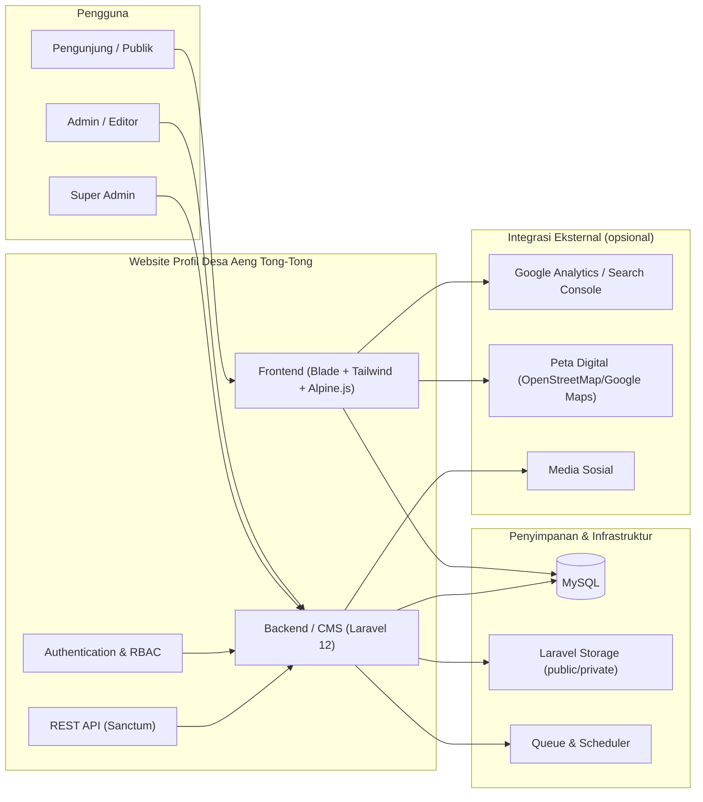
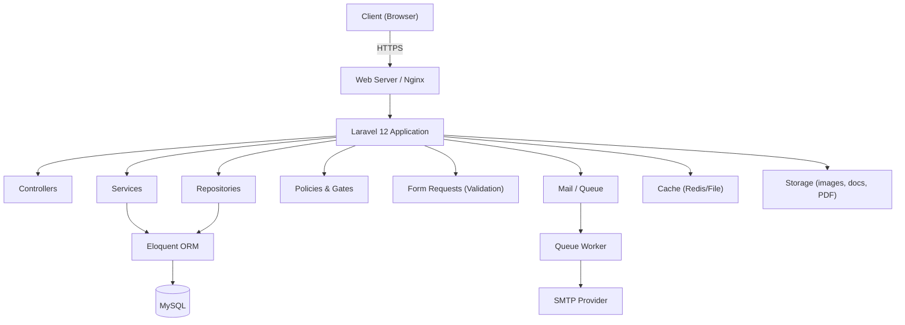

# 02 — Software Requirements Specification (SRS)

**Website Profil Desa Aeng Tong-Tong**

| Properti | Nilai |
| --- | --- |
| Kode Dokumen | ATT-SRS-01 |
| Versi | 1.0 |
| Standar Acuan | IEEE Std 830-1998 (Recommended Practice for Software Requirements Specifications) |
| Status | Final |
| Pemilik | Pemerintah Desa Aeng Tong-Tong |

---

## 1. Introduction

### 1.1 Purpose

Dokumen ini menjelaskan secara lengkap kebutuhan perangkat lunak **Website Profil Desa Aeng Tong-Tong**. Spesifikasi ini menjadi acuan utama bagi tim pengembangan (analis, arsitek, UI/UX, database engineer, dan developer) dalam merancang, membangun, menguji, dan memelihara sistem. Dokumen ini juga menjadi dasar persetujuan antara pemangku kepentingan dan tim teknis.

### 1.2 Scope

Sistem yang akan dikembangkan adalah aplikasi web berbasis **Laravel 12** yang terdiri atas:

1. **Portal Publik (Frontend)** — menyajikan informasi profil desa, wisata, kerajinan keris, UMKM, berita, pengumuman, agenda, galeri, statistik, APBDes, dokumen publik, kontak, dan FAQ.
2. **Panel Admin (Backend/CMS)** — mengelola seluruh konten, master data, media, statistik, APBDes, pengaturan website, pengguna, role & permission, serta aktivitas log.

Sistem **tidak** mencakup e-commerce, transaksi pembayaran, forum komunitas, dan integrasi sistem pemerintahan eksternal (lihat *Out of Scope* pada PRD).

### 1.3 Definitions, Acronyms, and Abbreviations

| Istilah | Definisi |
| --- | --- |
| SRS | Software Requirements Specification |
| CMS | Content Management System |
| CRUD | Create, Read, Update, Delete |
| Role | Peran pengguna yang menentukan hak akses |
| Permission | Izin spesifik untuk tindakan tertentu |
| Mpu / Empu | Perajin keris ahli |
| UMKM | Usaha Mikro, Kecil, dan Menengah |
| APBDes | Anggaran Pendapatan dan Belanja Desa |
| SEO | Search Engine Optimization |
| WYSIWYG | What You See Is What You Get (editor teks) |
| SLA | Service Level Agreement |
| RBAC | Role-Based Access Control |

### 1.4 References

- ATT-PRD-01 — Product Requirements Document (PRD)
- ATT-ERD-01 — Entity Relationship Diagram
- ATT-DB-01 — Database Design
- Dokumentasi resmi Laravel 12, PHP 8.3, MySQL 8.x, Tailwind CSS, Alpine.js, Chart.js, CKEditor, PDF.js

### 1.5 Overview

SRS ini disusun mengikuti struktur IEEE 830:
- **Bagian 2** — Gambaran keseluruhan sistem (Overall Description).
- **Bagian 3** — Spesifikasi kebutuhan fungsional & non-fungsional terperinci.
- **Bagian 4** — Persyaratan antarmuka eksternal.
- **Bagian 5–9** — Kebutuhan keamanan, kinerja, data, asumsi, dan kendala.

---

## 2. Overall Description

### 2.1 Product Perspective

Sistem berdiri sebagai aplikasi web mandiri (*standalone*) yang dikembangkan dari nol. Sistem tidak memiliki dependensi pada sistem eksternal wajib pada fase awal, tetapi dirancang agar dapat diintegrasikan (misalnya API data desa, Google Analytics, peta digital) di masa mendatang.

### 2.2 Product Functions

Fungsi utama sistem dikelompokkan dalam modul berikut:

1. **Autentikasi & Otorisasi** — login, logout, sesi, RBAC, Policy & Gate.
2. **Master Data Desa** — data desa, profil, sejarah, visi & misi, struktur organisasi, perangkat desa.
3. **Konten Informasi** — berita, pengumuman, agenda, FAQ.
4. **Media** — galeri foto, galeri video, banner/slider.
5. **Ekonomi & Budaya** — potensi desa, wisata, kerajinan keris/Mpu, UMKM.
6. **Data & Laporan** — statistik desa, statistik kependudukan, APBDes, dokumen & download.
7. **Layanan Publik** — kontak, form pesan.
8. **Administrasi Sistem** — manajemen pengguna, role & permission, pengaturan website, activity log, dashboard.

### 2.3 User Classes and Characteristics

| Kelas Pengguna | Karakteristik | Hak Akses |
| --- | --- | --- |
| **Guest (Pengunjung)** | Tidak login | Akses seluruh halaman publik, mengirim pesan, mengunduh dokumen publik |
| **Admin (Konten)** | Staf desa | Kelola konten, media, galeri, agenda, pesan (sesuai permission) |
| **Super Admin** | Pengelola sistem | Seluruh hak akses + manajemen pengguna, role, permission, pengaturan |

> Detail granular ditentukan melalui RBAC. Setiap aksi diperiksa menggunakan **Laravel Policy/Gate**.

### 2.4 Operating Environment

| Komponen | Spesifikasi |
| --- | --- |
| Server Web | Nginx 1.24+ / Apache 2.4+ |
| Bahasa | PHP 8.3+ |
| Framework | Laravel 12 |
| Basis Data | MySQL 8.x (InnoDB, utf8mb4) |
| Cache | Redis / Database cache |
| Sistem Operasi Server | Ubuntu 22.04 LTS / 24.04 LTS (Rekomendasi) |
| Peramban Didukung | Chrome, Firefox, Edge, Safari (2 versi terbaru) |
| Perangkat Klien | Desktop, tablet, mobile (responsive) |

### 2.5 Design and Implementation Constraints

1. Menggunakan **Laravel 12** dan **PHP 8.3+**.
2. Tampilan menggunakan **Blade + Tailwind CSS + Alpine.js**.
3. Kode mengikuti **PSR-12** dan prinsip **SOLID, DRY, KISS**.
4. Menggunakan **Service Layer** dan (jika diperlukan) **Repository Pattern**.
5. Validasi input melalui **Form Request**.
6. Otorisasi melalui **Policy & Gate**.
7. Seluruh akses ke data melewati **Eloquent ORM** (tanpa raw query kecuali kebutuhan khusus).
8. URL **SEO-friendly** (slug).
9. Keamanan bawaan Laravel: CSRF, XSS, SQL injection protection, hashing password.

### 2.6 User Documentation

- **Panduan Admin (Manual Penggunaan CMS)** — cara mengelola konten, media, dan pengaturan.
- **Dokumen Teknis** — SRS, Database Design, Folder Structure, Coding Standards.
- **README Instalasi** — langkah instalasi & konfigurasi project.

### 2.7 Assumptions and Dependencies

Asumsi:
- Server memiliki akses internet untuk pengiriman email dan pembaruan package.
- Pihak desa menyediakan data konten, foto, dan dokumen resmi.
- Admin memiliki pelatihan dasar penggunaan CMS.

Dependensi:
- Library eksternal via **Composer** (backend) dan **npm** (frontend).
- Layanan email (SMTP) untuk notifikasi.

---

## 3. Specific Requirements

### 3.1 Functional Requirements

Notasi: FR-XXX. Setiap kebutuhan fungsional mengacu pada modul.

#### Modul Autentikasi & Otorisasi

| ID | Deskripsi | Prioritas |
| --- | --- | --- |
| FR-001 | Sistem menyediakan login dengan email & password yang di-hash (bcrypt/argon2id). | M |
| FR-002 | Sistem menyediakan logout dan masa sesi aman. | M |
| FR-003 | Sistem mendukung RBAC: peran (role) dan izin (permission). | M |
| FR-004 | Sistem memeriksa otorisasi setiap aksi admin melalui Policy/Gate. | M |
| FR-005 | Sistem mencatat aktivitas login/logout pada activity log. | S |
| FR-006 | Sistem membatasi percobaan login gagal (throttling/rate limit). | M |

#### Modul Master Data Desa

| ID | Deskripsi | Prioritas |
| --- | --- | --- |
| FR-010 | Sistem menyimpan dan menampilkan data identitas desa (nama, kode, wilayah, luas, koordinat). | M |
| FR-011 | Sistem mengelola profil desa (deskripsi umum). | M |
| FR-012 | Sistem mengelola sejarah desa dalam format konten kaya (WYSIWYG). | M |
| FR-013 | Sistem mengelola visi dan misi desa. | M |
| FR-014 | Sistem mengelola struktur organisasi desa (bagan + deskripsi). | M |
| FR-015 | Sistem mengelola data perangkat desa (nama, jabatan, foto, kontak). | M |

#### Modul Konten (Berita, Pengumuman, Agenda, FAQ)

| ID | Deskripsi | Prioritas |
| --- | --- | --- |
| FR-020 | Sistem mengelola berita: judul, slug, kategori, konten WYSIWYG, gambar cover, tag, status, penulis, tanggal terbit. | M |
| FR-021 | Sistem menampilkan daftar berita dengan pagination, kategori, dan detail. | M |
| FR-022 | Sistem mengelola pengumuman dengan status (draf, terbit, ditunda) dan tanggal tayang. | M |
| FR-023 | Sistem mengelola agenda dengan tanggal, waktu, tempat, dan deskripsi. | M |
| FR-024 | Sistem mengelola FAQ (pertanyaan & jawaban). | S |
| FR-025 | Sistem menyediakan pencarian global konten. | S |

#### Modul Media

| ID | Deskripsi | Prioritas |
| --- | --- | --- |
| FR-030 | Sistem mengelola galeri foto dengan kategori dan keterangan. | M |
| FR-031 | Sistem menampilkan galeri foto dengan *lightbox* yang responsif. | M |
| FR-032 | Sistem mengelola galeri video (embed URL) dengan kategori. | M |
| FR-033 | Sistem mengelola banner/slider beranda. | M |

#### Modul Ekonomi & Budaya

| ID | Deskripsi | Prioritas |
| --- | --- | --- |
| FR-040 | Sistem mengelola potensi desa (jenis, deskripsi, ikon/gambar). | M |
| FR-041 | Sistem mengelola destinasi wisata (nama, deskripsi, gambar, lokasi, koordinat). | M |
| FR-042 | Sistem mengelola data Mpu/perajin keris (nama, keahlian, profil, foto). | M |
| FR-043 | Sistem mengelola data UMKM (nama, pemilik, kategori, deskripsi, kontak, logo). | M |

#### Modul Data & Laporan

| ID | Deskripsi | Prioritas |
| --- | --- | --- |
| FR-050 | Sistem mengelola data statistik desa per tahun dan per kategori. | M |
| FR-051 | Sistem mengelola statistik kependudukan (jumlah penduduk, jenis kelamin, usia, pekerjaan, agama, pendidikan). | M |
| FR-052 | Sistem menampilkan statistik dalam bentuk tabel dan grafik (Chart.js). | M |
| FR-053 | Sistem mengelola data APBDes (pendapatan, belanja, pembiayaan) per tahun. | M |
| FR-054 | Sistem mengelola dokumen publik (judul, kategori, file, status). | M |
| FR-055 | Sistem mencatat log unduhan dokumen. | S |
| FR-056 | Sistem menampilkan Buku Profil Desa (PDF) menggunakan PDF.js. | S |

#### Modul Layanan Publik

| ID | Deskripsi | Prioritas |
| --- | --- | --- |
| FR-060 | Sistem menampilkan halaman kontak dengan informasi alamat, telepon, email, dan peta. | M |
| FR-061 | Sistem menerima pesan melalui form (nama, email, subjek, pesan) dengan validasi. | M |
| FR-062 | Sistem menyimpan pesan dan menampilkan status (baru, dibaca, dibalas). | M |

#### Modul Administrasi Sistem

| ID | Deskripsi | Prioritas |
| --- | --- | --- |
| FR-070 | Sistem menampilkan dashboard admin dengan ringkasan data dan grafik. | M |
| FR-071 | Sistem mengelola pengguna (tambah, edit, nonaktifkan, reset password). | M |
| FR-072 | Sistem mengelola role dan permission (CRUD + pemetaan). | M |
| FR-073 | Sistem mengelola pengaturan website (nama, logo, kontak, media sosial, meta). | M |
| FR-074 | Sistem mencatat dan menampilkan activity log. | M |

#### Modul SEO & Aksesibilitas

| ID | Deskripsi | Prioritas |
| --- | --- | --- |
| FR-080 | Setiap halaman konten memiliki meta title, description, dan canonical. | M |
| FR-081 | Sistem menghasilkan sitemap.xml dan robots.txt. | M |
| FR-082 | Setiap gambar memiliki alt text; form memiliki label. | M |
| FR-083 | Navigasi utama dapat dioperasikan via keyboard. | S |

### 3.2 Non-Functional Requirements

| ID | Kategori | Deskripsi |
| --- | --- | --- |
| NFR-001 | Kinerja | Halaman publik dimuat < 3 detik pada koneksi 4G (Google PageSpeed ≥ 85 untuk mobile). |
| NFR-002 | Kinerja | API/admin response < 500 ms pada kondisi normal. |
| NFR-003 | Kinerja | Mendukung ≥ 1.000 pengguna bersamaan tanpa degradasi signifikan. |
| NFR-004 | Keamanan | Password di-hash; sesi dienkripsi; CSRF token aktif; XSS dinetralkan oleh Blade escaping. |
| NFR-005 | Keamanan | Rate limiting pada login dan form publik. |
| NFR-006 | Keamanan | Otorisasi granular: pengguna tidak dapat mengakses resource milik peran lain. |
| NFR-007 | Keamanan | Upload file divalidasi tipe & ukuran; disimpan di storage privat bila perlu. |
| NFR-008 | Ketersediaan | Uptime ≥ 99%; backup DB & file harian. |
| NFR-009 | Skalabilitas | Pemisahan cache & queue memungkinkan horizontal scaling. |
| NFR-010 | Responsif | Layout menyesuaikan breakpoint mobile, tablet, desktop. |
| NFR-011 | Aksesibilitas | Kontras minimal WCAG AA untuk teks utama. |
| NFR-012 | Kompatibilitas | Berjalan normal pada 2 versi terbaru Chrome, Firefox, Edge, Safari. |
| NFR-013 | Pemeliharaan | Kode terstruktur, dokumentasi lengkap, mengikuti PSR-12. |
| NFR-014 | Keandalan | Transaksi database (Eloquent) untuk operasi multi-tabel. |

---

## 4. External Interface Requirements

### 4.1 User Interfaces

- **Frontend:** Blade + Tailwind CSS + Alpine.js + AOS. Komponen UI reusable (Blade Components).
- **Admin:** Layout dashboard dengan sidebar, tabel CRUD, form, modal, dan notifikasi (SweetAlert2).
- Konsistensi desain: penggunaan desain system (warna, tipografi, spacing) terpusat di Tailwind config & komponen.

### 4.2 Hardware Interfaces

- Server: minimal 2 vCPU, 4 GB RAM, 50 GB SSD (rekomendasi production).
- Tidak ada antarmuka hardware khusus selain web server standar.

### 4.3 Software Interfaces

| Antarmuka | Keterangan |
| --- | --- |
| MySQL 8.x | Penyimpanan data utama via Eloquent. |
| Laravel Storage | Penyimpanan file (local/S3) untuk gambar & dokumen. |
| SMTP (Mail) | Pengiriman notifikasi email. |
| Queue Driver | Redis/Database untuk job (log, notifikasi, dsb.). |
| Google Analytics | Pelacakan trafik publik (opsional). |
| Embed Video | YouTube/Vimeo embed untuk galeri video. |
| Peta Digital | OpenStreetMap/Google Maps embed pada halaman kontak & wisata. |

### 4.4 Communication Interfaces

- HTTP/HTTPS (web) & AJAX (fetch/axios) untuk interaksi klien-server.
- JSON response untuk endpoint API internal (jika diperlukan).
- RESTful routes mengikuti konvensi Laravel (`Route::resource`).

---

## 5. Security Requirements

| ID | Kebutuhan |
| --- | --- |
| SEC-001 | Password minimal 8 karakter; di-hash dengan bcrypt (cost 12) / argon2id. |
| SEC-002 | Aktivasi CSRF token pada seluruh form POST. |
| SEC-003 | Rate limit login: 5 percobaan per menit per IP/email. |
| SEC-004 | Sanitasi & validasi seluruh input; Blade escaping untuk XSS. |
| SEC-005 | Restriksi upload: tipe MIME whitelist & ukuran maksimum (gambar ≤ 5MB, video ≤ 50MB, PDF ≤ 20MB). |
| SEC-006 | Akses admin via Policy: `viewAny`, `view`, `create`, `update`, `delete`. |
| SEC-007 | File privat disimpan di storage non-publik; diakses melalui controller dengan otorisasi. |
| SEC-008 | Logout invalidasi sesi; token regenerasi setelah login. |
| SEC-009 | Backup database & storage terjadwal. |

---

## 6. Performance Requirements

| ID | Kebutuhan |
| --- | --- |
| PERF-001 | Halaman publik: Time to First Byte (TTFB) < 800 ms; load penuh < 3 s (4G). |
| PERF-002 | Pencarian & listing dengan pagination: response < 500 ms. |
| PERF-003 | Gambar dioptimasi (WebP/AVIF via Intervention Image atau Laravel resize) dan lazy-load. |
| PERF-004 | Query berat (dashboard, statistik) memanfaatkan cache (Redis) & eager loading. |
| PERF-005 | Asset di-compile & minified untuk production. |

---

## 7. Data Requirements

1. Data disimpan pada **MySQL 8.x** dengan engine **InnoDB** dan charset **utf8mb4**.
2. Relasi antar tabel diimplementasikan dengan **Foreign Key** dan index.
3. Soft delete (`deleted_at`) pada data master & konten untuk audit & recovery.
4. Timestamp `created_at` / `updated_at` wajib pada tabel data.
5. Setiap entitas konten memiliki kolom `status` untuk workflow terbit/draf.
6. Data statistik & APBDes ditandai tahun (`year`) dan unik per kombinasi tahun+kategori.

> Detail lengkap pada dokumen [09-erD.md](./09-erd.md) dan [10-database-design.md](./10-database-design.md).

---

## 8. Assumptions

- Server production menggunakan Linux (Ubuntu 22.04/24.04) dengan Nginx.
- Domain & SSL disediakan oleh pihak desa/pemerintah.
- Pihak desa menyediakan konten, foto dokumentasi, dan dokumen resmi.
- Internet publik tersedia bagi pengunjung.
- Tim pengembangan memiliki akses ke server untuk deployment & backup.

---

## 9. Constraints

| No | Kendala |
| --- | --- |
| 1 | Wajib menggunakan stack yang ditentukan (Laravel 12, PHP 8.3+, MySQL, Tailwind, Alpine.js). |
| 2 | Pustaka frontend ditambah sesuai daftar (AOS, SweetAlert2, Chart.js, CKEditor, PDF.js). |
| 3 | Seluruh kode mengikuti standar PSR-12 & best practice Laravel. |
| 4 | Anggaran & timeline mengikuti roadmap yang disetujui. |
| 5 | Tidak ada akses ke sistem eksternal pemerintahan (Siskeudes, dll.) pada fase awal. |

---

## 10. Appendix — Diagram Arsitektur Sistem

