# 03 — Sitemap

**Website Profil Desa Aeng Tong-Tong**

| Properti | Nilai |
| --- | --- |
| Kode Dokumen | ATT-SM-01 |
| Versi | 1.0 |
| Status | Final |

---

## 1. Tujuan

Dokumen ini mendefinisikan **arsitektur informasi** (information architecture) situs, mencakup seluruh halaman **frontend (publik)** dan **backend (admin/CMS)**, termasuk hierarki, relasi, dan pemetaan ke modul teknis.

---

## 2. Sitemap Frontend (Publik)

```mermaid
flowchart TD
    HOME["/ — Beranda"] --> BAN["Banner / Slider"]
    HOME --> HFEAT["Konten Unggulan (Berita, Wisata, Keris)"]
    HOME --> HSTAT["Statistik Ringkas"]
    HOME --> HNEWS["Berita Terbaru"]
    HOME --> HAGEN["Agenda Mendatang"]

    HOME --> TENTANG["Tentang Desa"]
    TENTANG --> SEJARAH["/tentang/sejarah — Sejarah Desa"]
    TENTANG --> VISIMISI["/tentang/visi-misi — Visi & Misi"]
    TENTANG --> STRUKTUR["/tentang/struktur-organisasi — Struktur Organisasi"]
    TENTANG --> PERANGKAT["/tentang/perangkat-desa — Perangkat Desa"]

    HOME --> POTENSI["/potensi-desa — Potensi Desa"]

    HOME --> WISATA["/wisata — Wisata"]
    WISATA --> WISDETAIL["/wisata/{slug} — Detail Destinasi"]

    HOME --> KERIS["/kerajinan-keris — Kerajinan Keris"]
    KERIS --> KERISMPU["/kerajinan-keris/mpu — Para Mpu"]
    KERIS --> KERISINFO["/kerajinan-keris/{slug} — Artikel Keris"]

    HOME --> UMKM["/umkm — UMKM"]
    UMKM --> UMKMDETAIL["/umkm/{slug} — Detail UMKM"]

    HOME --> BERITA["/berita — Berita"]
    BERITA --> BERITAKAT["/berita/kategori/{slug} — Berita per Kategori"]
    BERITA --> BERITADETAIL["/berita/{slug} — Detail Berita"]

    HOME --> PENGUMUMAN["/pengumuman — Pengumuman"]
    PENGUMUMAN --> PENGDETAIL["/pengumuman/{slug} — Detail Pengumuman"]

    HOME --> AGENDA["/agenda — Agenda"]
    AGENDA --> AGDETAIL["/agenda/{slug} — Detail Agenda"]

    HOME --> GALERI["/galeri — Galeri"]
    GALERI --> GALFOTO["/galeri/foto — Galeri Foto"]
    GALERI --> GALVIDEO["/galeri/video — Galeri Video"]

    HOME --> STATISTIK["/statistik — Statistik Desa"]
    STATISTIK --> STATPENDUDUK["/statistik/kependudukan — Statistik Kependudukan"]
    STATISTIK --> STATLAIN["/statistik/{kategori} — Statistik per Kategori"]

    HOME --> APBDES["/apbdes — APBDes"]

    HOME --> DOKUMEN["/dokumen — Download Dokumen"]
    DOKUMEN --> DOKDETAIL["/dokumen/{id} — Detail & Unduh"]

    HOME --> PROFILEBOOK["/profil-desa — Buku Profil Desa (PDF.js)"]

    HOME --> KONTAK["/kontak — Kontak"]
    HOME --> FAQ["/faq — FAQ"]
    HOME --> CARI["/cari — Hasil Pencarian"]
    HOME --> ERROR["/404 · /500 — Halaman Error"]
```

### Ringkasan Halaman Frontend

| No | Halaman | URL (Slug) | Keterangan |
| --- | --- | --- | --- |
| 1 | Beranda | `/` | Landing page dengan slider, fitur, statistik ringkas |
| 2 | Sejarah Desa | `/tentang/sejarah` | Narasi sejarah |
| 3 | Visi & Misi | `/tentang/visi-misi` | Visi & misi desa |
| 4 | Struktur Organisasi | `/tentang/struktur-organisasi` | Bagan organisasi |
| 5 | Perangkat Desa | `/tentang/perangkat-desa` | Daftar perangkat |
| 6 | Potensi Desa | `/potensi-desa` | Potensi unggulan |
| 7 | Wisata | `/wisata` + detail | Destinasi wisata |
| 8 | Kerajinan Keris | `/kerajinan-keris` + detail | Profil keris & Mpu |
| 9 | UMKM | `/umkm` + detail | Daftar UMKM |
| 10 | Berita | `/berita` + kategori + detail | Berita & artikel |
| 11 | Pengumuman | `/pengumuman` + detail | Pengumuman resmi |
| 12 | Agenda | `/agenda` + detail | Kalender kegiatan |
| 13 | Galeri Foto | `/galeri/foto` | Album foto |
| 14 | Galeri Video | `/galeri/video` | Video embed |
| 15 | Statistik | `/statistik` | Data & grafik |
| 16 | APBDes | `/apbdes` | Realisasi anggaran |
| 17 | Dokumen | `/dokumen` | Arsip unduhan |
| 18 | Buku Profil | `/profil-desa` | PDF viewer |
| 19 | Kontak | `/kontak` | Info & form pesan |
| 20 | FAQ | `/faq` | Pertanyaan umum |
| 21 | Pencarian | `/cari?q=` | Hasil pencarian |

---

## 3. Sitemap Backend (Admin / CMS)

```mermaid
flowchart TD
    DASH["/admin — Dashboard"]

    MASTER["Master Data"]
    MASTER --> VILLAGE["Data Desa"]
    MASTER --> STRUCT["Struktur Organisasi"]
    MASTER --> OFFICIAL["Perangkat Desa"]
    MASTER --> CATBER["Kategori Berita"]
    MASTER --> CATGAL["Kategori Galeri"]
    MASTER --> CATVID["Kategori Video"]

    PROFIL["Profil Desa"]
    PROFIL --> SEJARAH["Sejarah Desa"]
    PROFIL --> VISI["Visi & Misi"]
    PROFIL --> POTENSI["Potensi Desa"]

    KONTEN["Konten"]
    KONTEN --> NEWS["Berita"]
    KONTEN --> ANNO["Pengumuman"]
    KONTEN --> AGEN["Agenda"]
    KONTEN --> FAQM["FAQ"]

    MEDIA["Media"]
    MEDIA --> GALERI["Galeri Foto"]
    MEDIA --> VIDEO["Video"]
    MEDIA --> BANNER["Banner / Slider"]

    EKO["Ekonomi & Budaya"]
    EKO --> WISATA["Wisata"]
    EKO --> KERIS["Kerajinan Keris & Mpu"]
    EKO --> UMKM["UMKM"]

    DATA["Data & Laporan"]
    DATA --> STAT["Statistik Desa"]
    DATA --> POPSTAT["Statistik Kependudukan"]
    DATA --> APBD["APBDes"]
    DATA --> DOK["Dokumen"]

    LAYANAN["Layanan"]
    LAYANAN --> PESAN["Pesan Masuk"]
    LAYANAN --> KONTAK["Kontak Desa"]

    SISTEM["Sistem"]
    SISTEM --> USERS["Manajemen Pengguna"]
    SISTEM --> ROLES["Role & Permission"]
    SISTEM --> SETTING["Pengaturan Website"]
    SISTEM --> LOG["Activity Log"]

    DASH --> MASTER
    DASH --> PROFIL
    DASH --> KONTEN
    DASH --> MEDIA
    DASH --> EKO
    DASH --> DATA
    DASH --> LAYANAN
    DASH --> SISTEM
```

### Ringkasan Menu Backend

| No | Grup | Modul | Keterangan |
| --- | --- | --- | --- |
| 1 | Dashboard | Dashboard | Ringkasan & grafik (Chart.js) |
| 2 | Master Data | Data Desa | Identitas desa |
| 3 | Master Data | Struktur Organisasi | Bagan organisasi |
| 4 | Master Data | Perangkat Desa | Data perangkat & jabatan |
| 5 | Master Data | Kategori (berita/galeri/video) | Master kategori |
| 6 | Profil Desa | Sejarah / Visi Misi / Potensi | Konten profil |
| 7 | Konten | Berita / Pengumuman / Agenda / FAQ | Konten informatif |
| 8 | Media | Galeri Foto / Video / Banner | Media & slider |
| 9 | Ekonomi | Wisata / Keris & Mpu / UMKM | Konten ekonomi-budaya |
| 10 | Data | Statistik / Kependudukan / APBDes / Dokumen | Data & laporan |
| 11 | Layanan | Pesan Masuk / Kontak | Layanan publik |
| 12 | Sistem | Pengguna / Role / Pengaturan / Activity Log | Administrasi sistem |

---

## 4. Pemetaan Halaman → Modul Teknis

| Halaman Frontend | Controller | Service | Model Utama |
| --- | --- | --- | --- |
| Beranda | `Frontend\HomeController` | `HomeService` | Banner, Berita, Agenda |
| Tentang & Sejarah | `Frontend\AboutController` | `ProfileService` | VillageProfile, VillageHistory |
| Visi & Misi | `Frontend\AboutController` | `ProfileService` | Vision, Mission |
| Struktur & Perangkat | `Frontend\AboutController` | `ProfileService` | OrganizationalStructure, VillageOfficial |
| Potensi | `Frontend\PotentialController` | `PotentialService` | VillagePotential |
| Wisata | `Frontend\TourismController` | `TourismService` | TourismDestination |
| Keris & Mpu | `Frontend\KerisController` | `KerisService` | KerisArtisan |
| UMKM | `Frontend\UmkmController` | `UmkmService` | Umkm |
| Berita | `Frontend\NewsController` | `NewsService` | News, NewsCategory |
| Pengumuman | `Frontend\AnnouncementController` | `AnnouncementService` | Announcement |
| Agenda | `Frontend\AgendaController` | `AgendaService` | Agenda |
| Galeri | `Frontend\GalleryController` | `GalleryService` | Gallery, Video |
| Statistik | `Frontend\StatisticController` | `StatisticService` | Statistic, PopulationStatistic |
| APBDes | `Frontend\ApbdesController` | `ApbdesService` | Apbdes |
| Dokumen | `Frontend\DocumentController` | `DocumentService` | Document, Download |
| Kontak | `Frontend\ContactController` | `MessageService` | Contact, Message |
| FAQ | `Frontend\FaqController` | `FaqService` | Faq |
| Pencarian | `Frontend\SearchController` | `SearchService` | Berbagai model |
