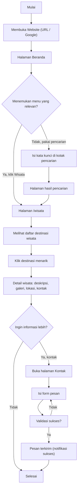
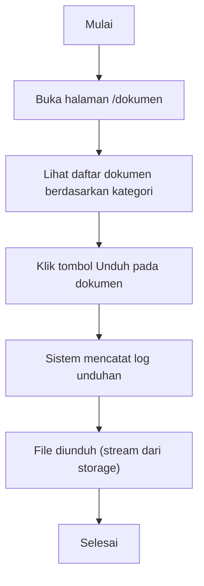
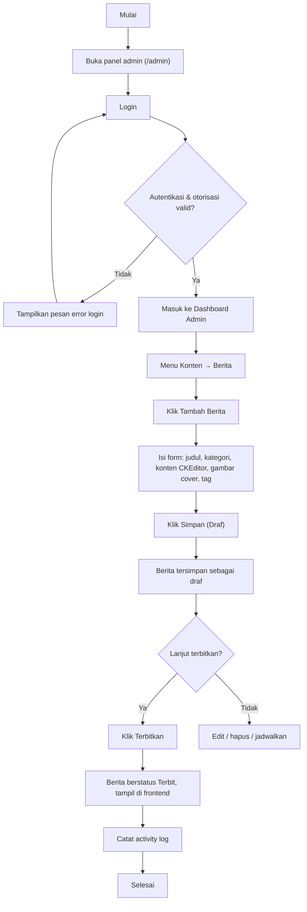
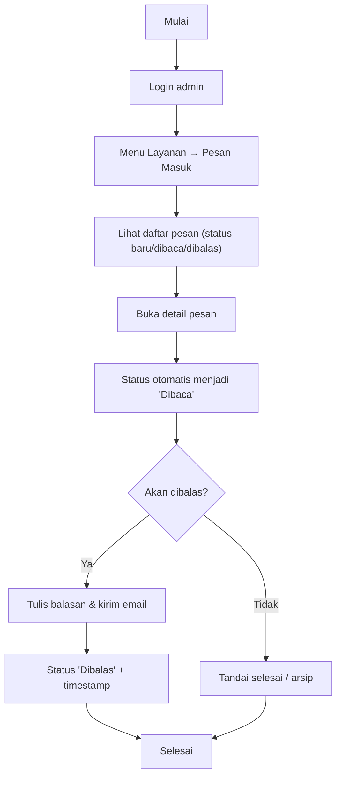
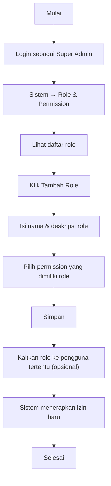
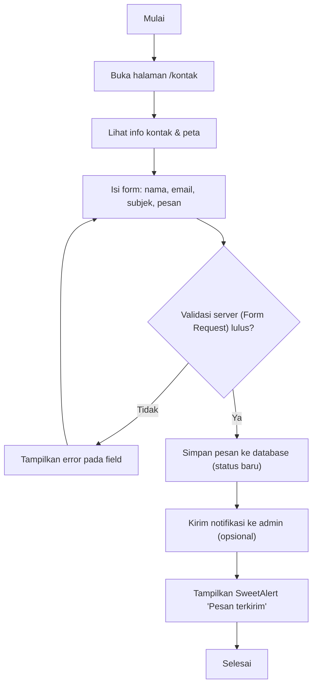
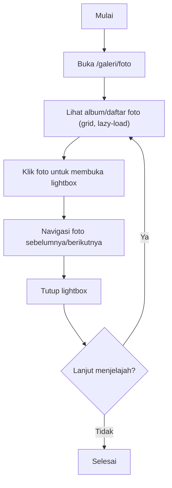
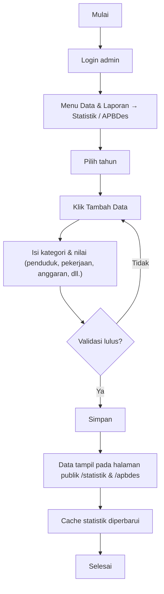

# 04 — User Flow

**Website Profil Desa Aeng Tong-Tong**

| Properti | Nilai |
| --- | --- |
| Kode Dokumen | ATT-UF-01 |
| Versi | 1.0 |
| Status | Final |

---

## 1. Tujuan

Dokumen ini menggambarkan **alur langkah pengguna** (user flow) dalam menyelesaikan tugas utama pada sistem, baik untuk sisi **publik (frontend)** maupun **admin (backend)**. Diagram dibuat dengan Mermaid *flowchart*.

---

## 2. User Flow — Pengunjung: Mencari Informasi Wisata (Mas Dimas)

---

## 3. User Flow — Pengunjung: Mengunduh Dokumen (Peneliti)

---

## 4. User Flow — Admin: Menerbitkan Berita (Bu Rina)

---

## 5. User Flow — Admin: Menjawab Pesan Masuk

---

## 6. User Flow — Super Admin: Membuat Role & Permission

---

## 7. User Flow — Publik: Mengirim Pesan via Form Kontak

---

## 8. User Flow — Pengunjung: Menelusuri Galeri Foto

---

## 9. User Flow — Admin: Mengelola Statistik & APBDes

