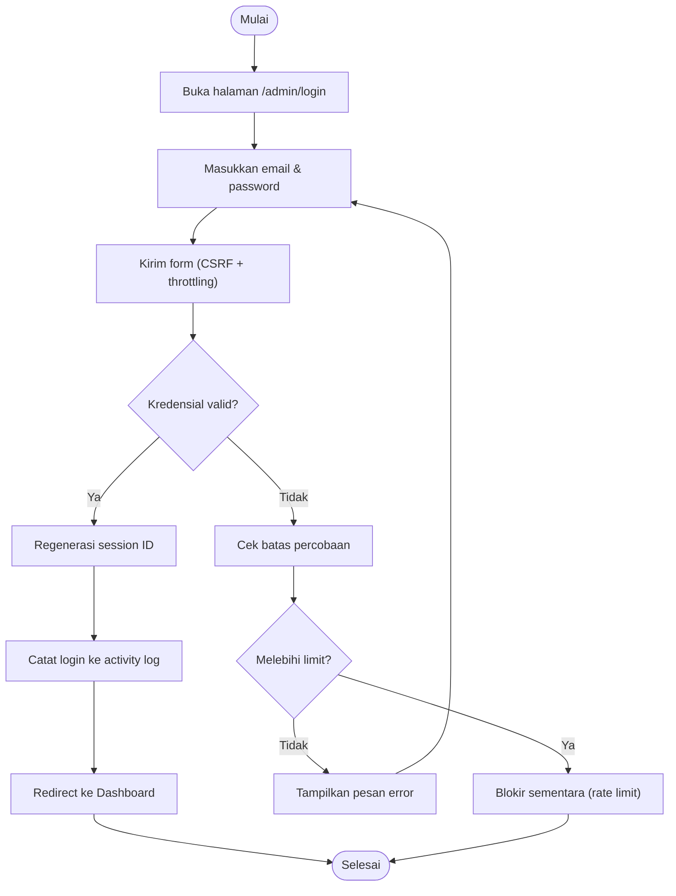
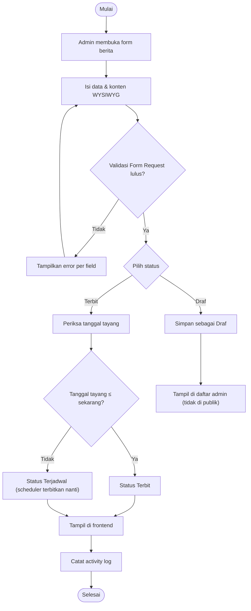
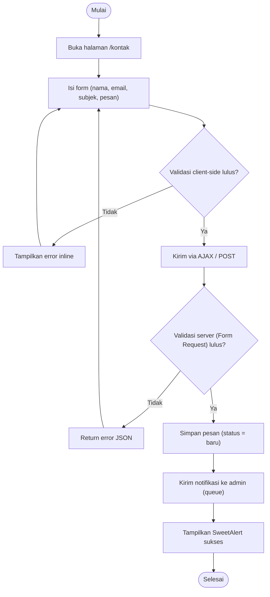
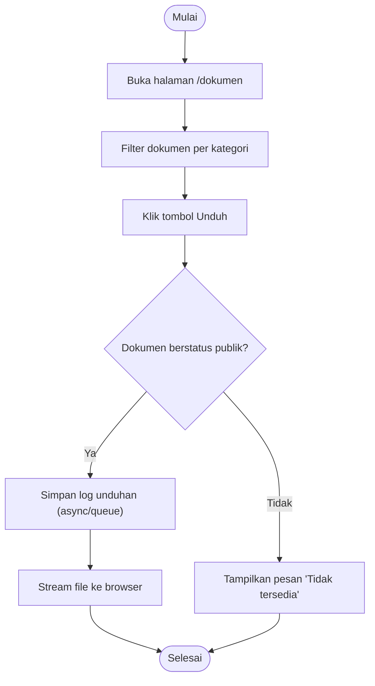
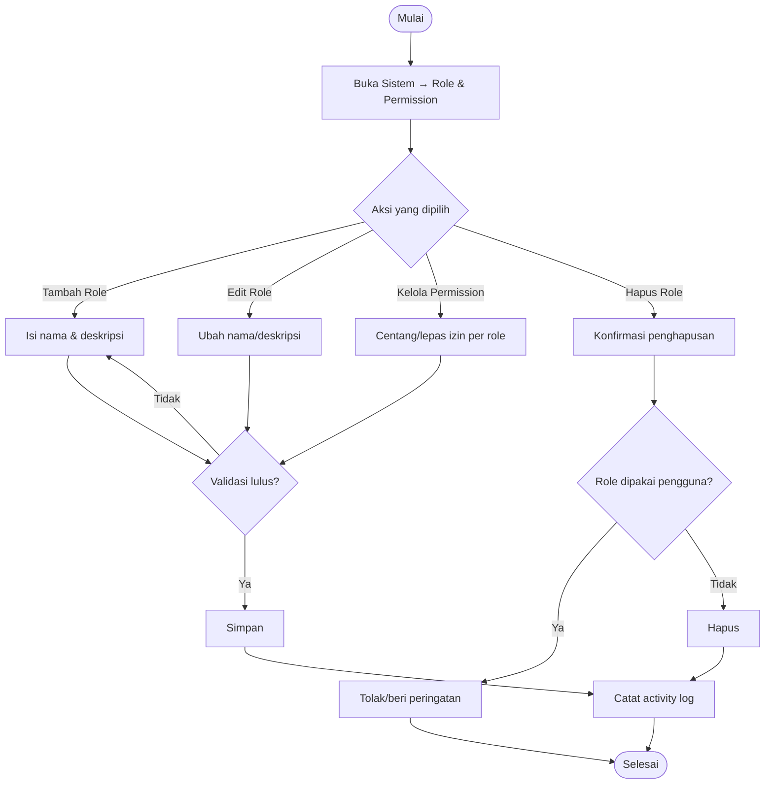
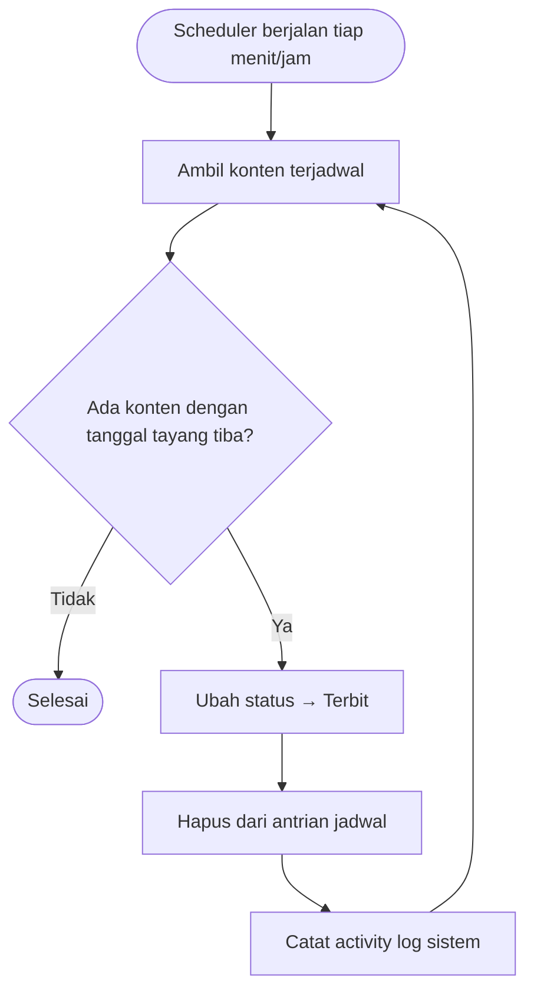

# 06 — Activity Diagram

**Website Profil Desa Aeng Tong-Tong**

| Properti | Nilai |
| --- | --- |
| Kode Dokumen | ATT-AD-01 |
| Versi | 1.0 |
| Status | Final |

---

## 1. Tujuan

Dokumen ini menggambarkan **alur aktivitas** (workflow) pada proses-proses kunci sistem, baik sisi publik maupun admin, menggunakan Mermaid *state/flowchart*.

---

## 2. Activity — Login Admin

---

## 3. Activity — Publikasi Berita (Workflow Draf → Terbit)

---

## 4. Activity — Pengunjung Mengirim Pesan Kontak

---

## 5. Activity — Unduh Dokumen Publik

---

## 6. Activity — Super Admin Mengelola Role

---

## 7. Activity — Scheduler Menertibkan Konten

