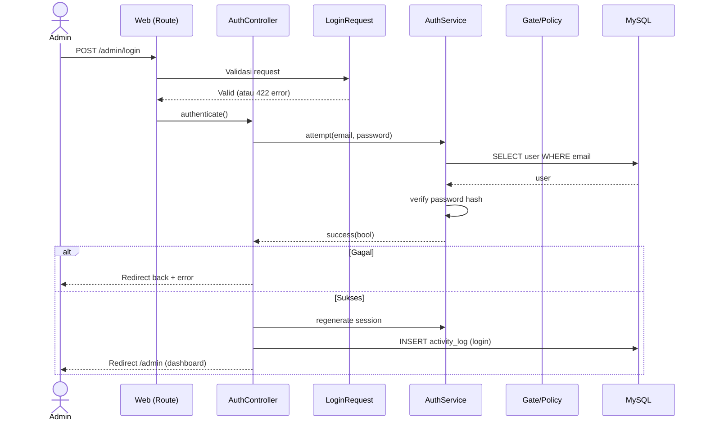
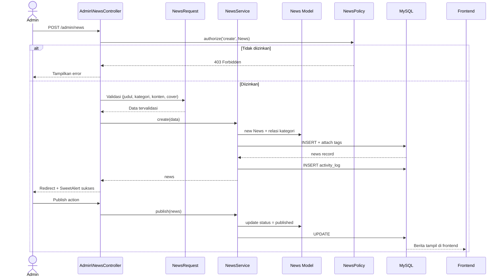
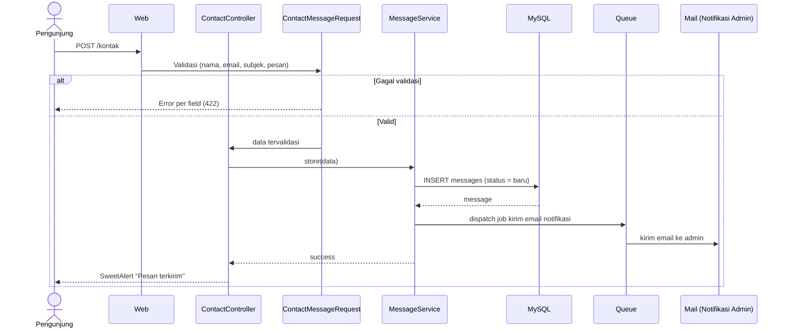
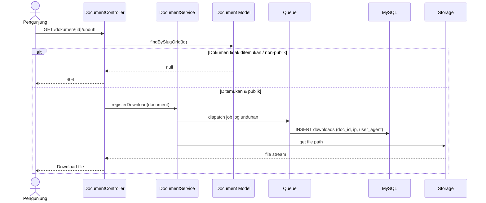
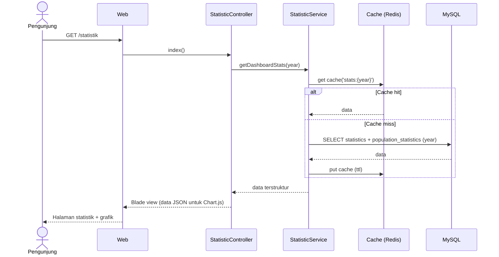
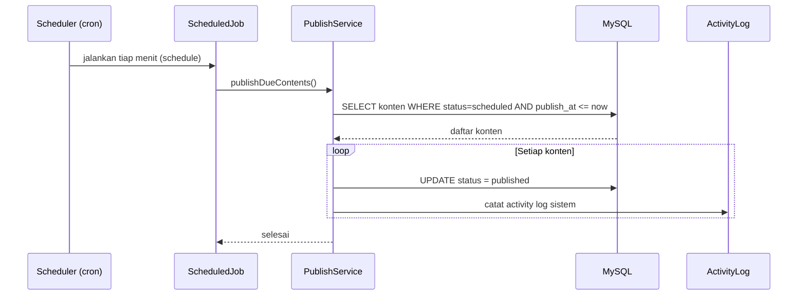
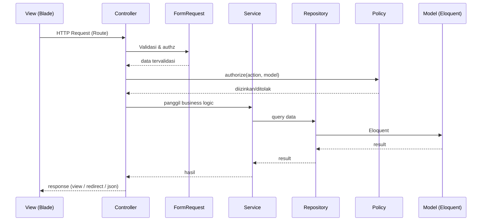

# 07 — Sequence Diagram

**Website Profil Desa Aeng Tong-Tong**

| Properti | Nilai |
| --- | --- |
| Kode Dokumen | ATT-SD-01 |
| Versi | 1.0 |
| Status | Final |

---

## 1. Tujuan

Dokumen ini menggambarkan **interaksi antar objek/komponen** secara berurutan (*time-ordered*) untuk skenario utama sistem, menggunakan Mermaid *sequenceDiagram*.

---

## 2. Sequence — Login Admin

---

## 3. Sequence — Admin Membuat & Menerbitkan Berita

---

## 4. Sequence — Pengunjung Mengirim Pesan Kontak

---

## 5. Sequence — Unduh Dokumen Publik

---

## 6. Sequence — Statistik & Grafik di Frontend

---

## 7. Sequence — Scheduler Menerbitkan Konten Terjadwal

---

## 8. Ringkasan Interaksi Antar Layer

