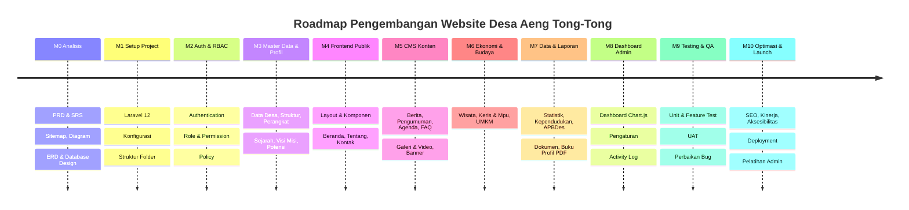
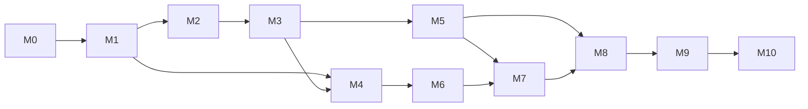

# 08 — Roadmap Pengembangan

**Website Profil Desa Aeng Tong-Tong**

| Properti | Nilai |
| --- | --- |
| Kode Dokumen | ATT-RD-01 |
| Versi | 1.0 |
| Status | Final |

---

## 1. Tujuan

Dokumen ini mendefinisikan **rencana kerja bertahap** (milestone) pengembangan sistem, mulai dari analisis hingga optimasi & peluncuran, termasuk keluaran (*deliverable*) per fase.

---

## 2. Timeline

---

## 3. Rincian Milestone

| Milestone | Nama | Durasi Estimasi | Keluaran (Deliverable) | Kriteria Selesai |
| --- | --- | --- | --- | --- |
| **M0** | Analisis Produk | 2 minggu | PRD, SRS, Sitemap, User Flow, Use Case, Activity, Sequence, Roadmap, ERD, Database Design, Folder Structure, Coding Standards | Seluruh dokumen disetujui pemangku kepentingan |
| **M1** | Setup Project | 3 hari | Project Laravel 12 ter-install, konfigurasi `.env`, struktur folder, Tailwind & Vite, dependensi (Alpine, AOS, Sweetalert2, Chart.js, CKEditor, PDF.js), git | Aplikasi dapat dijalankan, asset ter-compile |
| **M2** | Authentication & RBAC | 1 minggu | Tabel users/roles/permissions + pivot, seeder role & permission, login/logout, middleware, Policy & Gate, halaman profil akun | Admin & Super Admin dapat login dengan hak akses berbeda |
| **M3** | Master Data & Profil Desa | 2 minggu | CRUD data desa, profil, sejarah, visi-misi, struktur organisasi, perangkat desa, potensi | Seluruh data master terkelola dari panel admin |
| **M4** | Frontend Publik (Dasar) | 2 minggu | Layout umum (header, footer, nav), komponen Blade, beranda, halaman tentang, kontak, FAQ | Halaman publik tampil responsive & SEO-friendly |
| **M5** | CMS Konten & Media | 2–3 minggu | CRUD berita, kategori, pengumuman, agenda, FAQ, galeri foto, video, banner | Konten dapat dikelola & tampil di frontend |
| **M6** | Ekonomi & Budaya | 2 minggu | CRUD wisata, kerajinan keris & Mpu, UMKM | Halaman wisata/keris/UMKM lengkap |
| **M7** | Data & Laporan | 2 minggu | CRUD statistik, kependudukan, APBDes, dokumen, buku profil PDF (PDF.js), log unduhan | Data & dokumen tampil + dapat diunduh |
| **M8** | Dashboard & Sistem | 2 minggu | Dashboard admin (Chart.js), pengaturan website, activity log, notifikasi pesan | Dashboard informatif, sistem terkelola |
| **M9** | Testing & QA | 2 minggu | Unit test, feature test, UAT (User Acceptance Test), perbaikan bug | ≥ 90% test lulus, tidak ada bug kritikal |
| **M10** | Optimasi & Launch | 1–2 minggu | SEO lengkap, optimasi performa & cache, aksesibilitas, deployment, backup, pelatihan admin | Website live di production, admin terlatih |

**Estimasi total: ± 16–20 minggu (4–5 bulan).**

---

## 4. Dependency Antar Milestone

| Dependency | Keterangan |
| --- | --- |
| M2 ← M1 | Auth butuh project siap |
| M3 ← M2 | Master data butuh auth |
| M5 ← M2 & M3 | CMS butuh auth & master kategori |
| M7 ← M5 & M6 | Data/laporan memanfaatkan master konten |
| M8 ← M5 & M7 | Dashboard menampilkan data dari konten & statistik |
| M10 ← M9 | Launch setelah QA |

---

## 5. Prioritas Rilis

| Rilis | Konten | Tujuan |
| --- | --- | --- |
| **Rilis 0 (Internal Alpha)** | Setup + Auth + Master Data | Validasi fondasi teknis |
| **Rilis 1 (Internal Beta)** | Frontend dasar + CMS konten + media | Uji pengelolaan konten |
| **Rilis 2 (UAT)** | Semua modul + dashboard + statistik | UAT dengan admin desa |
| **Rilis 3 (Production)** | Optimasi + deployment + pelatihan | Publikasi resmi |

---

## 6. Manajemen Risiko Roadmap

| Risiko Jadwal | Mitigasi |
| --- | --- |
| Keterlambatan pengumpulan konten dari desa | Konten awal via seeder contoh; penambahan konten bertahap |
| Lingkup bertambah | Gunakan MoSCoW; perubahan masuk *change request* |
| Kesalahan teknis integrasi frontend | Modul frontend dikerjakan paralel dengan CMS, uji integrasi rutin |
| Ketergantungan sumber daya | Dokumentasi lengkap agar dapat dikerjakan beberapa developer |
