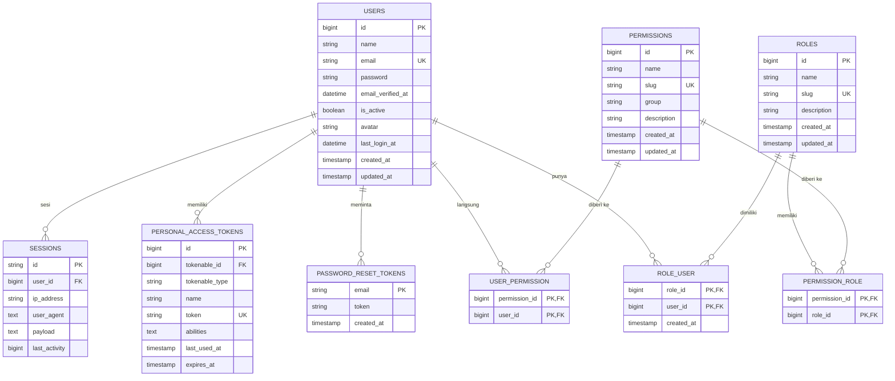
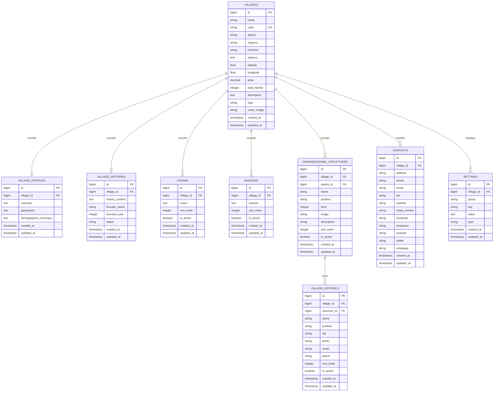
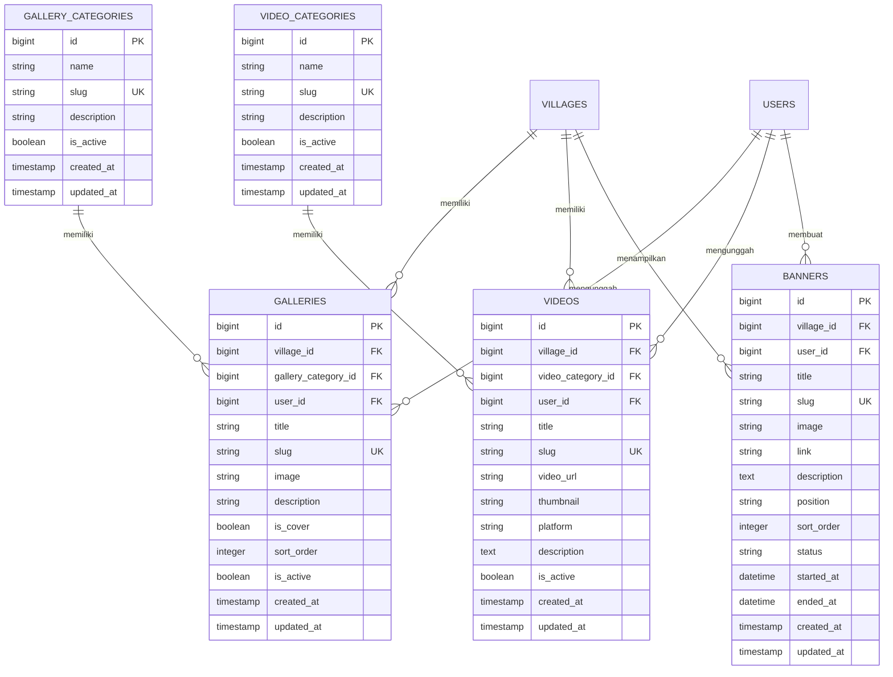
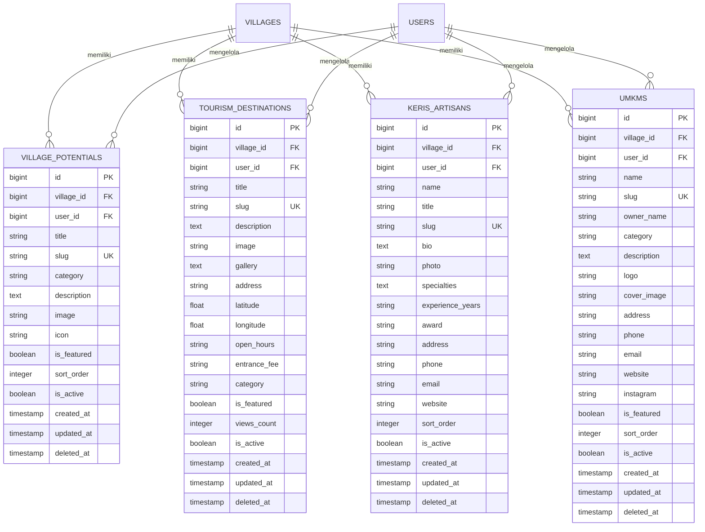
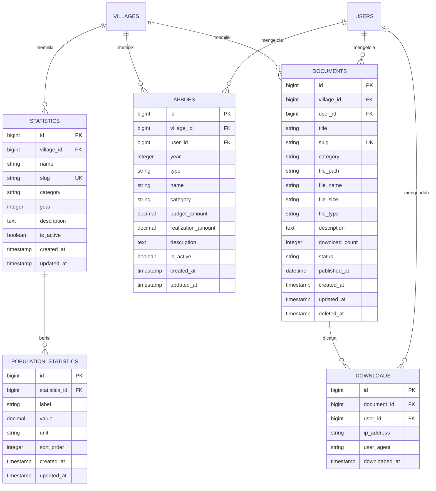
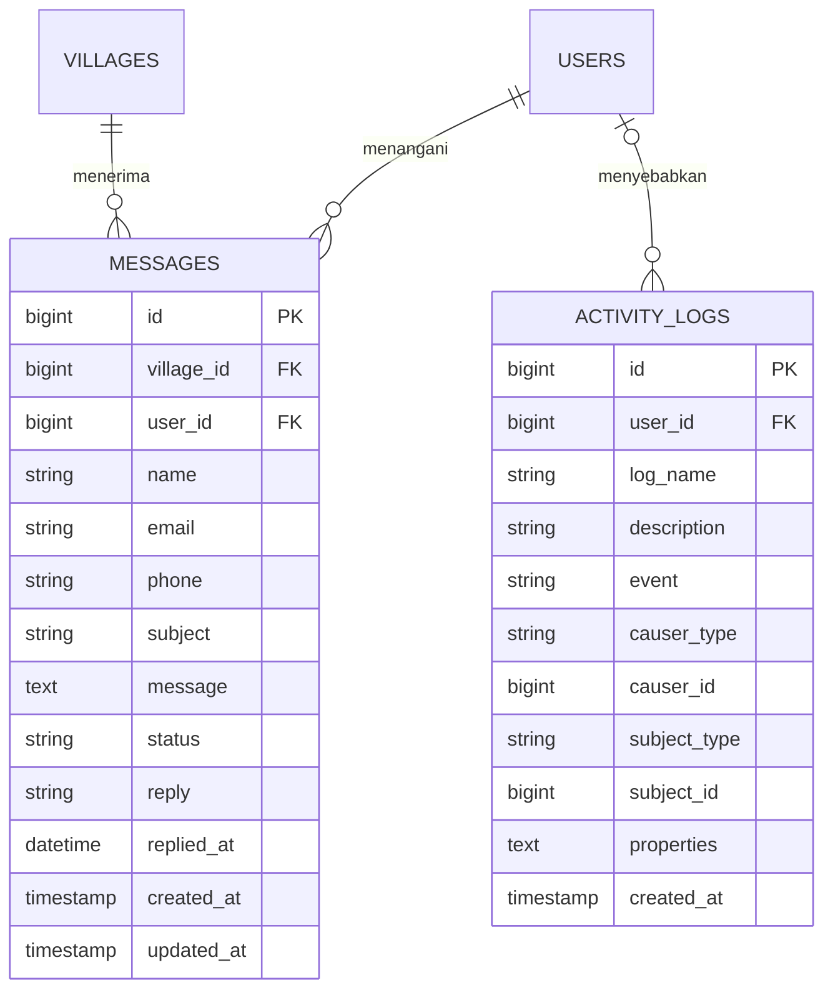

# 09 — ERD (Entity Relationship Diagram)

**Website Profil Desa Aeng Tong-Tong**

| Properti | Nilai |
| --- | --- |
| Kode Dokumen | ATT-ERD-01 |
| Versi | 1.0 |
| Status | Final |

---

## 1. Tujuan

Dokumen ini menggambarkan **hubungan antar entitas** (Entity Relationship) basis data. Notasi menggunakan **Mermaid ER Diagram** dengan kardinalitas *crow's foot*. Spesifikasi field lengkap (data type, default, index, constraint) ada pada dokumen [10-database-design.md](./10-database-design.md).

> Catatan: Diagram berikut menampilkan atribut kunci (PK, FK, dan field penting). Detail seluruh kolom dijelaskan per tabel pada dokumen database design.

---

## 2. Legenda Notasi

| Notasi | Arti |
| --- | --- |
| `||--o{` | Satu-ke-banyak (one-to-many) |
| `||--||` | Satu-ke-satu (one-to-one) |
| `}o--o{` | Banyak-ke-banyak (many-to-many via pivot) |
| `|o--o{` | Nol-atau-satu-ke-banyak |
| `PK` | Primary Key |
| `FK` | Foreign Key |

---

## 3. Diagram ERD — Modul Autentikasi & RBAC

---

## 4. Diagram ERD — Profil Desa & Pemerintahan

---

## 5. Diagram ERD — Konten Informasi (Berita, Pengumuman, Agenda, FAQ)

```mermaid
erDiagram
    NEWS_CATEGORIES ||--o{ NEWS : "memiliki"
    VILLAGES ||--o{ NEWS : "menerbitkan"
    USERS ||--o{ NEWS : "menulis"
    VILLAGES ||--o{ ANNOUNCEMENTS : "menerbitkan"
    USERS ||--o{ ANNOUNCEMENTS : "menulis"
    VILLAGES ||--o{ AGENDAS : "menyusun"
    USERS ||--o{ AGENDAS : "menulis"
    VILLAGES ||--o{ FAQS : "menyediakan"
    USERS ||--o{ FAQS : "menulis"

    NEWS_CATEGORIES {
        bigint id PK
        string name
        string slug UK
        string description
        boolean is_active
        timestamp created_at
        timestamp updated_at
    }

    NEWS {
        bigint id PK
        bigint village_id FK
        bigint news_category_id FK
        bigint user_id FK
        string title
        string slug UK
        string excerpt
        text content
        string cover_image
        string thumbnail
        string source
        json tags
        string status
        integer views_count
        datetime published_at
        timestamp created_at
        timestamp updated_at
        timestamp deleted_at
    }

    ANNOUNCEMENTS {
        bigint id PK
        bigint village_id FK
        bigint user_id FK
        string title
        string slug UK
        text content
        string attachment
        string status
        datetime published_at
        datetime expired_at
        timestamp created_at
        timestamp updated_at
        timestamp deleted_at
    }

    AGENDAS {
        bigint id PK
        bigint village_id FK
        bigint user_id FK
        string title
        string slug UK
        text description
        string location
        date event_date
        time start_time
        time end_time
        string status
        boolean is_featured
        timestamp created_at
        timestamp updated_at
        timestamp deleted_at
    }

    FAQS {
        bigint id PK
        bigint village_id FK
        bigint user_id FK
        string question
        text answer
        string category
        integer sort_order
        boolean is_active
        timestamp created_at
        timestamp updated_at
    }
```

---

## 6. Diagram ERD — Media (Galeri, Video, Banner)

---

## 7. Diagram ERD — Ekonomi & Budaya (Potensi, Wisata, Keris, UMKM)

---

## 8. Diagram ERD — Data & Laporan (Statistik, APBDes, Dokumen)

---

## 9. Diagram ERD — Layanan Publik & Audit

---

## 10. Tabel Pendukung (Sistem Framework)

Tabel berikut ditangani otomatis oleh framework (Laravel):

| Tabel | Fungsi |
| --- | --- |
| `jobs` | Antrian job (queue) |
| `job_batches` | Batch job |
| `failed_jobs` | Job gagal |
| `cache` | Cache database driver |
| `cache_locks` | Kunci cache |
| `personal_access_tokens` | Token API (Sanctum) |

---

## 11. Ringkasan Kardinalitas Utama

| Relasi | Kardinalitas | Keterangan |
| --- | --- | --- |
| VILLAGES → VILLAGE_PROFILES | 1 : 1 | Satu desa satu profil umum |
| VILLAGES → VILLAGE_HISTORIES | 1 : 1 | Satu desa satu catatan sejarah |
| VILLAGES → ORGANIZATIONAL_STRUCTURES | 1 : N | Satu desa banyak struktur |
| ORGANIZATIONAL_STRUCTURES → VILLAGE_OFFICIALS | 1 : N | Struktur berisi banyak perangkat |
| VILLAGES → NEWS/ANNOUNCEMENTS/AGENDAS | 1 : N | Konten milik desa |
| NEWS_CATEGORIES → NEWS | 1 : N | Kategori berisi banyak berita |
| USERS ↔ ROLES | M : N | Melalui `role_user` |
| ROLES ↔ PERMISSIONS | M : N | Melalui `permission_role` |
| STATISTICS → POPULATION_STATISTICS | 1 : N | Data statistik berisi baris rinci |
| DOCUMENTS → DOWNLOADS | 1 : N | Log unduhan per dokumen |
