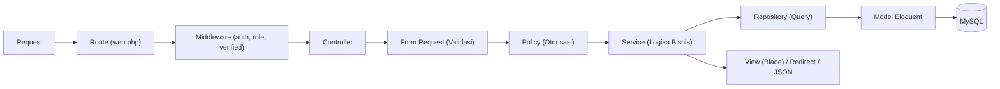

# 11 — Struktur Folder Laravel

**Website Profil Desa Aeng Tong-Tong**

| Properti | Nilai |
| --- | --- |
| Kode Dokumen | ATT-FS-01 |
| Versi | 1.0 |
| Status | Final |

---

## 1. Tujuan

Dokumen ini menjelaskan struktur folder Laravel 12 yang digunakan untuk proyek ini, termasuk pendekatan arsitektur (*Service Layer*, *Repository Pattern*), organisasi model, request, policy, komponen Blade, dan pemisahan view frontend/admin.

---

## 2. Prinsip Arsitektur

- **Layered:** Route → Controller → FormRequest → Service → Repository → Model.
- **Pemisahan peran:** Controller hanya mengatur HTTP; Service memuat logika bisnis; Repository (jika kompleks) menangani query; Policy mengatur otorisasi.
- **Pemisahan presentasi:** View dipisah antara `frontend/` (publik) dan `admin/` (panel CMS).
- **Konvensi Laravel & PSR-4** untuk autoloading; namespace konsisten.

---

## 3. Struktur Folder Utama

```text
att-web/
├── app/
│   ├── Actions/                    # Kelas aksi single-responsibility (opsional)
│   ├── Console/
│   │   └── Commands/               # Command artisan custom (mis. publish scheduled)
│   ├── Enums/                      # Enum status (NewsStatus, MessageStatus, dsb.)
│   ├── Exceptions/                 # Exception handler & custom exception
│   ├── Helpers/                    # Helper global (format rupiah, tanggal, slug)
│   ├── Http/
│   │   ├── Controllers/
│   │   │   ├── Auth/               # Auth controllers
│   │   │   ├── Admin/              # Admin CMS controllers
│   │   │   │   ├── MasterData/     # Desa, struktur, perangkat, kategori
│   │   │   │   ├── Profile/        # Profil, sejarah, visi misi, potensi
│   │   │   │   ├── Content/        # Berita, pengumuman, agenda, FAQ
│   │   │   │   ├── Media/          # Galeri, video, banner
│   │   │   │   ├── Economy/        # Wisata, keris, UMKM
│   │   │   │   ├── DataReport/     # Statistik, APBDes, dokumen
│   │   │   │   ├── Service/        # Pesan masuk, kontak
│   │   │   │   └── System/         # Pengguna, role, permission, setting, log
│   │   │   └── Frontend/           # Public-facing controllers
│   │   ├── Middleware/             # Custom middleware (ex. force-https)
│   │   ├── Requests/               # Form Request validations
│   │   │   ├── Admin/
│   │   │   └── Frontend/
│   │   └── Resources/              # (default laravel; API resources bila perlu)
│   ├── Models/                     # Seluruh model Eloquent
│   ├── Observers/                  # Model observers (slug otomatis, cache bust)
│   ├── Policies/                   # Laravel Policies per modul
│   ├── Repositories/               # Repository pattern (interfaces + concrete)
│   ├── Services/                   # Service layer per modul
│   ├── Traits/                     # Reusable traits (HasSlug, HasStatus, dsb.)
│   ├── ViewModels/                 # ViewModel/Data presenter (opsional)
│   └── Providers/                  # Service providers (AppServiceProvider, dsb.)
│
├── bootstrap/
├── config/                         # Konfigurasi (app, database, filesystems, dsb.)
├── database/
│   ├── factories/                  # Model factories (news, users, dsb.)
│   ├── migrations/                 # Seluruh migration
│   └── seeders/                    # Database seeders (roles, permissions, desa)
│
├── public/
│   ├── build/                      # Asset ter-compile (Vite)
│   ├── storage/                    # Symlink ke storage/app/public
│   └── index.php
│
├── resources/
│   ├── css/                        # CSS entry
│   ├── js/                         # JS entry (app.js, admin.js)
│   ├── views/
│   │   ├── components/             # Blade components reusable
│   │   │   ├── frontend/           #   komponen publik
│   │   │   └── admin/              #   komponen admin
│   │   ├── frontend/               # View publik
│   │   │   ├── layouts/            #   layout publik
│   │   │   ├── home/               #   beranda
│   │   │   ├── about/              #   tentang, sejarah, visi misi
│   │   │   ├── organization/       #   struktur & perangkat
│   │   │   ├── potential/          #   potensi desa
│   │   │   ├── tourism/            #   wisata
│   │   │   ├── keris/              #   kerajinan keris
│   │   │   ├── umkm/               #   UMKM
│   │   │   ├── news/               #   berita
│   │   │   ├── announcement/       #   pengumuman
│   │   │   ├── agenda/             #   agenda
│   │   │   ├── gallery/            #   galeri foto
│   │   │   ├── video/              #   galeri video
│   │   │   ├── statistic/          #   statistik
│   │   │   ├── apbdes/             #   APBDes
│   │   │   ├── document/           #   dokumen
│   │   │   ├── profilebook/        #   buku profil PDF
│   │   │   ├── contact/            #   kontak
│   │   │   ├── faq/                #   FAQ
│   │   │   ├── search/             #   pencarian
│   │   │   ├── partials/           #   partial (header, footer, dsb.)
│   │   │   └── errors/             #   halaman error (404, 500)
│   │   └── admin/                  # View panel admin
│   │       ├── layouts/            #   layout admin (sidebar, navbar)
│   │       ├── dashboard/          #   dashboard
│   │       ├── master-data/
│   │       ├── profile/
│   │       ├── content/
│   │       ├── media/
│   │       ├── economy/
│   │       ├── data-report/
│   │       ├── service/
│   │       ├── system/
│   │       └── partials/           #   partial admin (flash, modal, dsb.)
│   └── lang/                       # Translation files (id, en)
│
├── routes/
│   ├── web.php                     # Route publik + admin
│   ├── console.php                 # Scheduler
│   └── api.php                     # (opsional, Sanctum)
│
├── storage/
│   ├── app/
│   │   ├── public/
│   │   │   ├── images/             # Gambar (berita, galeri, wisata)
│   │   │   ├── videos/             # Video/thumbnail
│   │   │   └── documents/          # File dokumen & PDF
│   │   └── private/                # File privat (jika ada)
│   ├── framework/
│   └── logs/
│
├── tests/
│   ├── Feature/                    # Feature tests per modul
│   └── Unit/                       # Unit tests service/repository
│
├── .env.example
├── composer.json
├── package.json
├── tailwind.config.js
├── vite.config.js
└── artisan
```

---

## 4. Detail Folder Inti

### 4.1 `app/Http/Controllers`

Dibagi menjadi namespace:

| Namespace | Isi | Contoh |
| --- | --- | --- |
| `App\Http\Controllers\Auth` | Autentikasi | `LoginController` |
| `App\Http\Controllers\Frontend` | Controller publik | `HomeController`, `NewsController`, `ContactController` |
| `App\Http\Controllers\Admin` | Controller CMS | `Admin\NewsController`, `Admin\DashboardController` |

Setiap controller mengikuti pola: delegasi validasi ke Form Request, panggil Service, kembalikan response.

### 4.2 `app/Models`

Semua model menggunakan:
- `HasFactory` trait.
- Konstanta enum status (dari `app/Enums`).
- Relasi Eloquent yang eksplisit (`hasMany`, `belongsTo`, `belongsToMany`).
- Casting proper (`casts`).
- Trait `HasSlug` (untuk slug otomatis) dan `SoftDeletes` untuk konten.

### 4.3 `app/Services`

Lapisan logika bisnis. Satu service per domain:

| Service | Tanggung Jawab |
| --- | --- |
| `AuthService` | Login, sesi, last login |
| `ProfileService` | Profil, sejarah, visi misi |
| `NewsService` | CRUD berita + publish workflow |
| `MediaService` | Galeri, video, banner |
| `StatisticService` | Statistik & cache |
| `DocumentService` | Dokumen & log unduhan |
| `MessageService` | Pesan masuk & balasan |
| `SettingService` | Pengaturan website |

### 4.4 `app/Repositories`

Untuk query kompleks / data agregat (dashboard, statistik). Interface di `Repositories\Contracts`, implementasi di `Repositories\Eloquent`.

```text
Repositories/
├── Contracts/
│   └── NewsRepositoryInterface.php
└── Eloquent/
    └── NewsRepository.php
```

Dinjeksi melalui DI di `AppServiceProvider` (binding interface → concrete).

### 4.5 `app/Policies`

Satu policy per model: `NewsPolicy`, `UmkmPolicy`, `UserPolicy`, dst. Metode mengikuti konvensi Laravel (`viewAny`, `view`, `create`, `update`, `delete`, `restore`, `forceDelete`). Authorization dilakukan melalui `Gate` / `$this->authorize()`.

### 4.6 `app/Observers`

`NewsObserver`, `UmkmObserver`, dll. untuk:
- Menghasilkan slug otomatis.
- Membersihkan/men-bust cache saat data berubah.
- Mencatat activity log secara otomatis (jika tidak memakai package).

### 4.7 `app/Enums`

```text
Enums/
├── NewsStatus.php        # Draft, Published, Scheduled
├── AnnouncementStatus.php
├── MessageStatus.php     # Baru, Dibaca, Dibalas
├── ApbdesType.php        # Pendapatan, Belanja, Pembiayaan
├── CommonStatus.php      # Active, Inactive
└── StatisticCategory.php
```

### 4.8 `app/Traits`

- `HasSlug` — pembuatan slug unik.
- `HasStatus` — helper status aktif/tidak.
- `HasActivityLog` — otomatis mencatat log.
- `HasUploads` — helper upload & hapus file.

### 4.9 `app/Helpers`

```text
Helpers/
├── helpers.php           # formatRupiah(), formatTanggal(), dsb.
```

Diregistrasi di `composer.json` (autoload files).

### 4.10 `resources/views/components`

Blade components reusable dengan namespace:

```text
resources/views/components/
├── frontend/
│   ├── navbar.blade.php
│   ├── footer.blade.php
│   ├── banner-slider.blade.php
│   ├── news-card.blade.php
│   ├── section-heading.blade.php
│   └── ...
└── admin/
    ├── sidebar.blade.php
    ├── topbar.blade.php
    ├── card.blade.php
    ├── datatable-actions.blade.php
    ├── form-input.blade.php
    ├── form-select.blade.php
    └── ...
```

### 4.11 `routes/web.php`

```php
// Route publik
Route::get('/', [HomeController::class, 'index'])->name('home');
// ...dsb.

// Route admin (middleware auth + role)
Route::prefix('admin')
    ->name('admin.')
    ->middleware(['auth', 'verified', 'role:admin,super-admin'])
    ->group(function () {
        Route::resource('news', Admin\NewsController::class);
        // ...
    });
```

### 4.12 `database`

- **Migrations:** berurutan sesuai modul (auth → master → konten → media → ekonomi → data).
- **Factories:** untuk seeder data contoh (news, umkm, dsb.).
- **Seeders:** `RolePermissionSeeder` (role & permission default), `VillageSeeder` (identitas desa Aeng Tong-Tong), `DemoContentSeeder` (konten contoh).

---

## 5. Alur Request (Rangkuman)



---

## 6. Aturan Penamaan

| Elemen | Aturan | Contoh |
| --- | --- | --- |
| Controller | `{Nama}Controller`, namespace sesuai area | `Admin\NewsController` |
| Form Request | `{Aksi}{Entity}Request` | `StoreNewsRequest`, `UpdateNewsRequest` |
| Service | `{Entity}Service` | `NewsService` |
| Repository | `{Entity}Repository` + Interface | `NewsRepositoryInterface` |
| Policy | `{Entity}Policy` | `NewsPolicy` |
| Model | Singular PascalCase | `News`, `KerisArtisan`, `Umkm` |
| Migration | Laravel default | `2026_08_02_000001_create_news_table` |
| View | snake_case, prefix area | `frontend.news.show`, `admin.news.create` |
| Route name | `area.entity.action` | `admin.news.store`, `frontend.home` |
